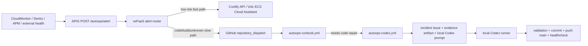

# VerseCraft Auto-Ops

## Architecture



## No Cloud Codex

VerseCraft does not use `OPENAI_API_KEY` for auto-ops. GitHub Actions never runs `openai/codex-action`.

Code repair is local:

```bash
pnpm autoops:local-codex -- --issue <issue_number> --push-main
```

Long-running local polling:

```bash
pnpm autoops:local-loop -- --interval-ms 300000 --push-main
```

If the local machine is off, server runbooks can still execute in GitHub Actions, but local Codex code repair will not run until the local runner is started again.

## Local Commands

```bash
pnpm autoops:discover
pnpm autoops:sync-secrets
pnpm autoops:provision
pnpm autoops:self-test
pnpm autoops:simulate -- --type app_health_failed --dry-run
pnpm autoops:simulate -- --type disk_high --dry-run
pnpm autoops:healthcheck
```

## GitHub Secrets and Variables

Secrets:

- `VOLC_AK`
- `VOLC_SK`
- `VOLC_REGION`
- `COOLIFY_API_KEY`
- `COOLIFY_BASE_URL`
- `COOLIFY_APP_UUID`
- `VOLC_ECS_INSTANCE_IDS`
- `AUTOOPS_ALERT_ROUTER_SECRET`

Do not sync `GITHUB_TOKEN`; workflows use the built-in `github.token`.
Do not configure `OPENAI_API_KEY` for this flow.

Variables:

- `AUTOOPS_DEPLOY_MODE=observe`
- `AUTOOPS_CODE_FIX_MODE=local`
- `AUTOOPS_SITE_URL=https://versecraft.cn`
- `AUTOOPS_HEALTH_URL=https://versecraft.cn/api/health`

## Coolify

`COOLIFY_BASE_URL` can be the Coolify root URL or the `/api/v1` URL. Scripts try:

- `GET /health`
- `GET /resources`
- `GET /deployments`
- `GET /deploy?uuid=...`
- `GET /deployments/{uuid}`
- `GET/POST /applications/{uuid}/restart`
- `GET/POST /applications/{uuid}/start`

Current default is `AUTOOPS_DEPLOY_MODE=observe` because this repo already has `Sync Gitee Branches` triggering Coolify after CI success. Switch to `api` only after confirming there is no duplicate deploy path.

## Volc CloudMonitor Webhook

APIG URL shape:

```text
https://<apig-domain>/autoops/alert?secret=<AUTOOPS_ALERT_ROUTER_SECRET>
```

Callback payload examples live in `.ops/autoops/templates/`.
The router reads `x-volc-trace-id`, generates `incident_key`, and dedupes within the function process.

## Volc OpenAPI Basis

`scripts/autoops/lib/volc-openapi.mjs` uses HMAC-SHA256 OpenAPI signing against `https://open.volcengineapi.com`.

References:

- RunCommand: `https://www.volcengine.com/docs/6396/170753`
- DescribeInvocationResults: `https://www.volcengine.com/docs/6396/170924`
- CLI format: `https://www.volcengine.com/docs/6396/1149352`
- OpenAPI signing: `https://www.volcengine.com/docs/6348/69827`

If veFaaS or APIG API parameters are uncertain, do not guess. Use the generated package and the shortest console steps in `provision-result.json`.

## veFaaS + APIG

Run:

```bash
pnpm autoops:provision
```

Outputs:

- `.ops/autoops/runtime/vefaas-alert-router.zip`
- `.ops/autoops/runtime/provision-result.json`
- `.ops/autoops/runtime/cloudmonitor-webhook-url.txt`

Console fallback:

1. Create or update a Node.js 22 veFaaS function named `versecraft-autoops-alert-router`.
2. Upload `.ops/autoops/runtime/vefaas-alert-router.zip`.
3. Set handler to `index.handler`.
4. Configure required environment variable names from `CONFIG.md`; do not paste values into chat or Git.
5. Create APIG route `POST /autoops/alert` and bind it to the function.
6. Configure CloudMonitor/Sentry/external health callbacks to the APIG URL.

## Windows Local Loop

PowerShell foreground loop:

```powershell
cd D:\versecraft
pnpm autoops:local-loop -- --interval-ms 300000 --push-main
```

Windows Task Scheduler action:

```text
Program: powershell.exe
Arguments: -NoProfile -ExecutionPolicy Bypass -Command "cd D:\versecraft; pnpm autoops:local-loop -- --interval-ms 300000 --push-main"
```

## Disable Auto-Ops

- Disable the APIG route or rotate/remove `AUTOOPS_ALERT_ROUTER_SECRET`.
- Disable `autoops-runbook.yml`, `autoops-codex.yml`, and `autoops-postdeploy.yml`.
- Remove CloudMonitor/Sentry/APM webhooks.
- Stop the local Codex loop.
