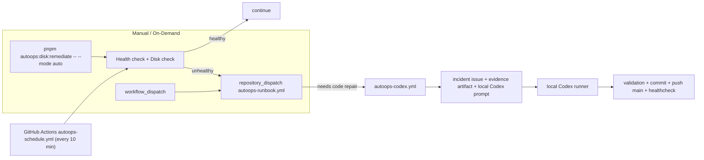

# VerseCraft Auto-Ops

## Architecture



## No Cloud Codex

VerseCraft does not use `OPENAI_API_KEY` for auto-ops. GitHub Actions never runs `openai/codex-action`.

Code repair is local:

```bash
pnpm autoops:local-codex -- --issue <issue_number> --push-main
```

Long-running local polling:

```bash
pnpm autoops:local-loop -- --interval-ms 300000 --push-main
```

If the local machine is off, server runbooks can still execute in GitHub Actions, but local Codex code repair will not run until the local runner is started again.

## Local Commands

```bash
pnpm autoops:discover
pnpm autoops:sync-secrets
pnpm autoops:provision
pnpm autoops:self-test
pnpm autoops:simulate -- --type app_health_failed --dry-run
pnpm autoops:simulate -- --type disk_high --dry-run
pnpm autoops:healthcheck
```

## GitHub Secrets and Variables

Secrets:

- `VOLC_AK`
- `VOLC_SK`
- `VOLC_REGION`
- `COOLIFY_API_KEY`
- `COOLIFY_BASE_URL`
- `COOLIFY_APP_UUID`
- `VOLC_ECS_INSTANCE_IDS`
Do not sync `GITHUB_TOKEN`; workflows use the built-in `github.token`.
Do not configure `OPENAI_API_KEY` for this flow.

Variables:

- `AUTOOPS_DEPLOY_MODE=observe`
- `AUTOOPS_CODE_FIX_MODE=local`
- `AUTOOPS_SITE_URL=https://versecraft.cn`
- `AUTOOPS_HEALTH_URL=https://versecraft.cn/api/health`

## Coolify

`COOLIFY_BASE_URL` can be the Coolify root URL or the `/api/v1` URL. Scripts try:

- `GET /health`
- `GET /resources`
- `GET /deployments`
- `GET /deploy?uuid=...`
- `GET /deployments/{uuid}`
- `GET/POST /applications/{uuid}/restart`
- `GET/POST /applications/{uuid}/start`

Current default is `AUTOOPS_DEPLOY_MODE=observe` because this repo already has `Sync Gitee Branches` triggering Coolify after CI success. Switch to `api` only after confirming there is no duplicate deploy path.

## Scheduled Checks (replaces CloudMonitor + APIG + VeFaaS)

APIG and VeFaaS have been removed (saving ¥1,050/month). Auto-ops now uses
GitHub Actions scheduled workflows instead of push-based webhooks.

The `autoops-schedule.yml` workflow runs every 10 minutes and performs:
- Health check (HTTP 200 on versecraft.cn + Coolify API)
- Hourly disk check via `disk-remediate --mode auto`
- Auto-dispatch `autoops-runbook` on failures

## Volc OpenAPI Basis

`scripts/autoops/lib/volc-openapi.mjs` uses HMAC-SHA256 OpenAPI signing against `https://open.volcengineapi.com`.

References:

- RunCommand: `https://www.volcengine.com/docs/6396/170753`
- DescribeInvocationResults: `https://www.volcengine.com/docs/6396/170924`
- CLI format: `https://www.volcengine.com/docs/6396/1149352`
- OpenAPI signing: `https://www.volcengine.com/docs/6348/69827`

If veFaaS or APIG API parameters are uncertain, do not guess. Use the generated package and the shortest console steps in `provision-result.json`.

## Scheduled Workflow

No provisioning needed. The `autoops-schedule.yml` workflow runs automatically
once pushed to `main`. Enable it immediately via:

```bash
gh workflow enable autoops-schedule.yml
```

Or trigger manually from the GitHub Actions UI (`workflow_dispatch`).

## Windows Local Loop

PowerShell foreground loop:

```powershell
cd D:\versecraft
pnpm autoops:local-loop -- --interval-ms 300000 --push-main
```

Windows Task Scheduler action:

```text
Program: powershell.exe
Arguments: -NoProfile -ExecutionPolicy Bypass -Command "cd D:\versecraft; pnpm autoops:local-loop -- --interval-ms 300000 --push-main"
```

## Disable Auto-Ops

- Disable `autoops-schedule.yml`, `autoops-runbook.yml`, `autoops-codex.yml`, and `autoops-postdeploy.yml`.
- Stop the local Codex loop.
