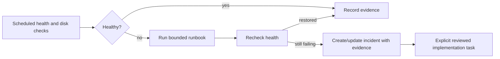

# VerseCraft Auto-Ops

Auto-Ops 负责可审计的健康检查、证据采集和有限的确定性运维修复。它不会调用生成式代码 writer，也不会自动修改、commit 或 push 仓库代码。


```mermaid
flowchart LR
  A["Scheduled health and disk checks"] --> B{"Healthy?"}
  B -->|yes| C["Record evidence"]
  B -->|no| D["Run bounded runbook"]
  D --> E["Recheck health"]
  E -->|restored| C
  E -->|still failing| F["Create/update incident with evidence"]
  F --> G["Explicit reviewed implementation task"]
```

保留的确定性动作包括：

- HTTP/Coolify 健康检查
- ECS 诊断
- 受边界保护的磁盘清理
- o11y agent 重启
- Coolify restart/deploy
- `deploy-selfheal.mjs` 对瞬时基础设施失败的有限重试

常用命令：

```bash
pnpm autoops:discover
pnpm autoops:sync-secrets
pnpm autoops:self-test
pnpm autoops:healthcheck
pnpm autoops:start
pnpm autoops:disk:remediate -- --mode auto
pnpm autoops:coolify:selfheal
```

当 runbook 无法恢复服务时，工作流可以创建或更新 incident，并上传 `.ops/autoops/runtime/` 证据。后续代码修改必须通过显式、可审阅的实现任务进行。

已退役：本地 Codex/Claude polling runner、自动验证后 commit/push main、`AUTOOPS_CODE_FIX_MODE` 和 `AUTOOPS_CODEX_COMMAND`。

`autoops-codex.yml` 保留历史文件名以避免外部 dispatch 断裂，但其行为现在仅为 evidence handoff，不会运行或指示自动代码修复。
