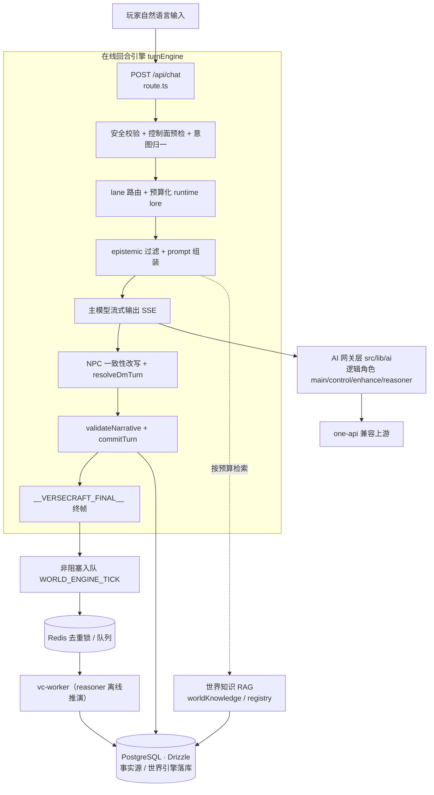

<p align="center">
  
</p>

<h1 align="center">文界工坊 VerseCraft</h1>

<p align="center"><strong>AI 互动叙事平台：让大模型作为「故事运行时」，实时承接、推进与扩展一部可游玩的互动小说。</strong></p>

<p align="center">
  
  
  
  
  =22.22" />
  
  <a href="https://versecraft.cn"></a>
</p>

---

## 这是什么

VerseCraft 不是把小说塞进聊天框，而是把**世界观、规则、选择与后果**交给大模型在玩家眼前实时运行。

玩家用一句自然语言描述自己想做什么（而不是从固定选项里点选），AI 会结合当前场景、世界规则、角色状态与时间推进来裁定后果，再把结果继续展开为新的叙事、新的选择和新的压力。底座被设计成一个**平台**而非单一故事页面：同一套互动叙事引擎可以承载悬疑、校园、科幻、末日等不同题材，当前以可游玩的起始世界「序章·暗月」作为能力验证样板。

技术上它是一个 Next.js 16 / React 19 单体应用，内含完整的回合引擎、AI 网关抽象、世界知识 RAG、后台世界推演 worker、内容安全合规层与管理后台，已部署上线。

## 🔗 在线体验

**https://versecraft.cn** （生产环境 · 简体中文）

## ✨ 核心特性

- **自然语言行动，而非点选题** — 玩家直接输入「我贴着墙往前走」「我敲门三下立刻后退」，由主模型裁定结果，输入真正改变剧情走向。
- **分阶段回合引擎** — `POST /api/chat` 把一次回合拆为安全校验、控制面预检、意图归一、lane 路由、prompt 组装、主模型流式生成、NPC 一致性改写、`validateNarrative` + `commitTurn`、`__VERSECRAFT_FINAL__` 终帧等阶段（`src/lib/turnEngine/*`），将「事实提交」与「文案生成」分离，便于审计与回退。
- **统一大模型基础设施** — 业务代码不直接 `fetch` 模型，全部经 `src/lib/ai` 网关层（one-api 兼容）。按**逻辑角色** `main / control / enhance / reasoner` 抽象，真实上游型号只存在于环境变量或 one-api 控制台，换模型无需改业务代码（`src/lib/ai/tasks/taskPolicy.ts` 维护任务→角色映射与禁止路由表）。
- **韧性与降级** — 网关层内置超时、重试，以及按 provider 与按逻辑角色的进程内熔断（`src/lib/ai/fallback/circuitBreaker.ts`、`modelCircuit.ts`），并支持 `full / safe / emergency` 运行模式；未配置网关时仍返回 `200` + SSE 并带 `X-VerseCraft-Ai-Status: keys_missing` 降级帧。
- **世界知识 RAG** — 世界事实从硬编码逐步迁移到「稳定规则前缀 + 运行时检索 lore 注入」，运行时调用 `getRuntimeLore(...)` 按预算检索（`src/lib/worldKnowledge/*`），`registry` 承担 bootstrap / fallback。
- **后台世界推演（World Director）** — `reasoner` 角色仅用于离线任务；在线回合终帧后**非阻塞**入队 `WORLD_ENGINE_TICK`，由 worker（`scripts/vc-worker.ts`）消费并生成 NPC 后续行动、世界事件、剧情分支种子等，落库到 `world_engine_runs / world_engine_event_queue / world_engine_agenda_snapshots`。
- **认知一致性（Epistemic）与叙事校验** — 事实按「DM 专属 / 场景公共 / 玩家私密 / 角色私有 / 情绪残响」分桶，post-generation validator 检测 DM-only 泄露、位置冲突、reveal 越权、选项退化等问题并按严重度回退（`src/lib/epistemic/*`、`turnEngine/validateNarrative.ts`）。
- **内容安全合规层** — 本地场景化策略引擎为主裁判（白名单 + 回退叙事 + JSON 契约保序），可选接入外部文本审核作为风险信号之一，带独立的失败模式与熔断配置（`src/lib/safety/*`）；附用户协议、隐私政策、未成年人、AI 免责声明等法务页面（`src/app/legal/*`）。
- **客户端持久化与离线** — 存档走 IndexedDB（`idb-keyval`），含 service worker（`public/sw.js`）与离线页，存档结构带快照兼容层。

## 🏗 架构



> 数据真相源为 PostgreSQL；Redis 仅用于去重锁、热缓存与限流协调。`PLAYER_CHAT` 主链路禁止路由到 `reasoner` / `enhance`（见 `taskPolicy.ts` 的 `TASK_ROLE_FORBIDDEN`），离线推演不阻塞在线回合。

## 🧰 技术栈

| 维度 | 选型 | 说明 |
|------|------|------|
| 运行时 | Node.js ≥ 22.22（`.node-version` 锁 22.22.2） | `engines` 强约束 |
| 框架 | Next.js 16 + React 19 | App Router；生产用 `output: "standalone"` |
| 语言 | TypeScript 5 | 全量 TS |
| 样式 | Tailwind CSS v4 | 经 `@tailwindcss/postcss` |
| 状态管理 | Zustand 5 | 客户端游戏状态 |
| 数据库 | PostgreSQL + Drizzle ORM | `drizzle-kit` 管理迁移（`drizzle/*.sql`） |
| 缓存 / 限流 | Redis + `@upstash/ratelimit` | 去重锁、热缓存、速率限制 |
| 鉴权 | NextAuth v5（beta）+ bcryptjs | Credentials provider，见 `auth.ts` |
| 人机校验 | ALTCHA（`altcha` / `altcha-lib`） | 注册 / 关键操作防滥用 |
| AI 接入 | one-api 兼容网关（OpenAI Chat Completions 形态） | 逻辑角色抽象，型号在环境变量 |
| 客户端存档 | IndexedDB（`idb-keyval`） | 含 service worker / 离线页 |
| 校验 | Zod 4 | 运行时 schema 校验 |
| 测试 | `tsx --test`（单测）+ Playwright（E2E）+ k6（压测） | SSE 契约 / 延迟预算 / admin 烟测 |
| 部署 | Docker（多阶段 standalone）+ Coolify | `Dockerfile` 暴露 3000，`/api/health` 健康检查 |
| 包管理 | pnpm 10 | `pnpm-lock.yaml` frozen |

## 🚀 快速开始

前置依赖：Node.js ≥ 22.22.0、pnpm 10、PostgreSQL（可用 `docker compose` 起本地实例）。

```bash
# 1. 克隆
git clone https://github.com/bei666qi-pan/VerseCraft.git
cd VerseCraft

# 2. 安装依赖
pnpm install

# 3. 配置环境变量：复制模板并按需填写
cp .env.example .env.local

# 4.（可选）启动本地 PostgreSQL / Redis
docker compose --profile local up -d
# 或仅起 PostgreSQL：pnpm postgres:local

# 5. 推送数据库 schema
pnpm db:push

# 6. 启动开发服务器（默认端口 666）
pnpm dev
```

打开 http://localhost:666 ，进入「铸造角色」分配属性后即可开局。未配置 AI 网关时页面仍可运行，AI 回合会以降级方式响应。

常用命令：

```bash
pnpm build               # 生产构建
pnpm test:unit           # 单元测试（含 turnEngine 契约）
pnpm test:e2e:chat       # /api/chat SSE 契约 E2E（Playwright）
pnpm test:ci             # eslint + 单测 + db:check + build（与 CI 对齐）
pnpm verify:ai-gateway   # 探测 AI 网关连通性
pnpm worker:kg           # 启动后台世界推演 worker
```

> 注：`pnpm dev` 实为 `next dev --webpack -p 666`，故开发服务器固定在端口 `666`（见 `package.json` scripts）。

## ⚙️ 配置

所有配置以 [`.env.example`](./.env.example) 为模板，复制为 `.env.local` 后填写。**仓库内不含任何真实密钥**（模板里全部是 `replace_with_*` / `change_me` 等占位值）；生产环境的密钥统一在 Coolify 的 Environment Variables 面板配置。关键变量：

| 变量 | 用途 |
|------|------|
| `DATABASE_URL` | PostgreSQL 连接串（必需） |
| `REDIS_URL` | Redis 连接串（去重锁 / 限流 / 缓存） |
| `AUTH_SECRET` / `AUTH_TRUST_HOST` | NextAuth 会话签名与反代信任 |
| `ADMIN_PASSWORD` | 管理后台登录口令 |
| `ALTCHA_HMAC_KEY` | ALTCHA 人机校验 HMAC |
| `AI_GATEWAY_PROVIDER` / `AI_GATEWAY_BASE_URL` / `AI_GATEWAY_API_KEY` | one-api 兼容网关接入 |
| `AI_MODEL_MAIN` / `AI_MODEL_CONTROL` / `AI_MODEL_ENHANCE` / `AI_MODEL_REASONER` | 逻辑角色对应的上游模型名 |
| `AI_OPERATION_MODE` | 运行模式 `full` \| `safe` \| `emergency` |
| `MIGRATE_ON_BOOT` / `RUNTIME_SCHEMA_ENSURE` | 启动时迁移 / 运行时确保 schema |
| `MODERATION_*` / `BAIDU_SINAN_*` | 内容审核开关与外部审核信号（详见 `docs/deployment-coolify.md`） |

更多说明见 `docs/environment.md`、`docs/ai-architecture.md`、`docs/ai-gateway.md`、`docs/local-development.md`。

## 📁 目录结构

```text
VerseCraft/
├── src/
│   ├── app/                # Next.js App Router：页面 + API 路由
│   │   ├── api/chat/       # 玩家回合主入口（SSE）
│   │   ├── api/admin/      # 管理后台 API
│   │   ├── api/health/     # 健康检查
│   │   ├── play/           # 主游玩页
│   │   └── legal/          # 用户协议/隐私/未成年人/AI 免责声明
│   ├── lib/
│   │   ├── ai/             # 统一大模型网关（角色 / 路由 / 熔断 / 流式）
│   │   ├── turnEngine/     # 分阶段回合引擎
│   │   ├── worldEngine/    # 后台世界推演触发与队列
│   │   ├── worldKnowledge/ # 世界知识 RAG（检索 / 摄取 / canon）
│   │   ├── epistemic/      # 认知一致性分桶与校验
│   │   ├── safety/         # 内容安全合规策略引擎
│   │   ├── security/       # 风险分 lane / 限流 / 审计
│   │   └── registry/       # 世界事实 bootstrap / fallback
│   ├── features/play/      # 玩法与流式交互逻辑
│   ├── components/         # 界面组件（含 admin）
│   ├── store/              # Zustand 游戏状态
│   └── db/                 # Drizzle schema 与连接
├── drizzle/                # SQL 迁移文件
├── scripts/                # 运维 / 评测 / worker / autoops 脚本
├── e2e/                    # Playwright 端到端测试
├── docs/                   # 架构与运维文档
├── Dockerfile              # 多阶段 standalone 生产镜像
└── docker-compose.yml      # 本地 PG/Redis（local）+ worker（production/worker）profile
```

## 部署

生产链路遵循「GitHub（事实源）→ Gitee（国内镜像）→ Coolify（火山引擎 ECS）」：

1. 推送到 GitHub `main` / `preview`，触发 GitHub Actions `CI`（eslint + 单测 + 生产构建 + admin 烟测）。
2. CI 成功后 `Sync Gitee Branches` workflow 把对应 commit 镜像同步到 Gitee（GitHub 为唯一事实源，`--force-with-lease`）。
3. 同一 workflow 调用 Coolify API 触发部署，并轮询部署状态与 `/api/health`，直至健康。

Coolify 侧使用仓库 `Dockerfile`（多阶段 standalone）：监听端口 `3000`，健康检查 `GET /api/health`，`start-period` 60s 为启动迁移留时间，运行时密钥全部在 Coolify 面板注入。预览站 `preview.versecraft.cn` 为独立 Coolify 应用，从 Gitee `preview` 分支部署，使用独立的数据库 / Redis / 密钥。详见 `docs/deployment-coolify.md` 与 `docs/deployment-preview.md`。

## License

[MIT](./LICENSE) © 2026 VerseCraft Contributors

英文版说明见 [README.en.md](./README.en.md)。
