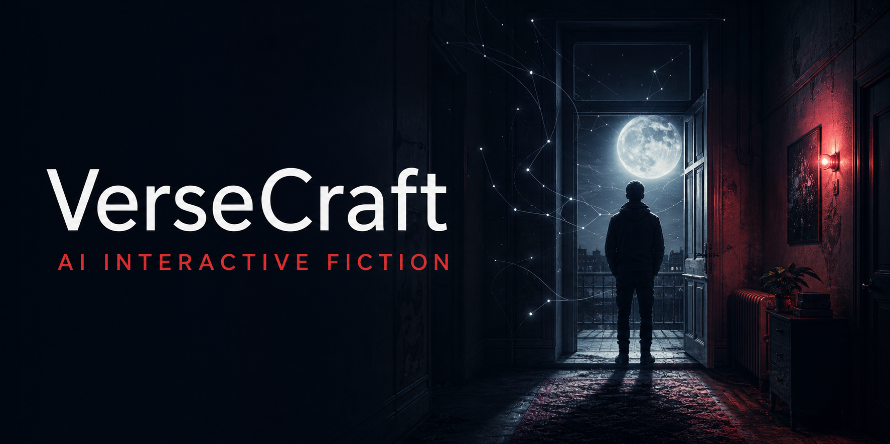
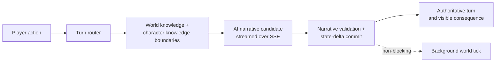

<p align="center">
  
</p>

<h1 align="center">VerseCraft</h1>

<p align="center">
  <strong>AI-powered interactive fiction, where every player action becomes a real turn in a living story world.</strong>
</p>

<p align="center">
  <a href="https://versecraft.cn"><strong>Play the live demo</strong></a>
  &nbsp;·&nbsp;
  <a href="./README.zh-CN.md">简体中文</a>
  &nbsp;·&nbsp;
  <a href="#build-a-world">Build a world</a>
</p>

<p align="center">
  
  
  
  
  
</p>



> **Not a novel in a chat box.** VerseCraft is a browser-based story runtime: players write what they do in natural language, and the system resolves the rules, state, knowledge, consequences, and next beat of the world.

## A playable consequence engine

Most AI fiction stops at the next paragraph. VerseCraft starts with the next action.

```text
Player: “I knock three times, then step away from the door.”
        ↓
World:  checks the scene, time, player state, rules, and what each character can know
        ↓
Result: streams the narrative, commits structured state changes, and advances the world
```

The point is agency you can feel: the player is not selecting a prewritten branch or prompting a companion. They are testing a world that can answer back.

## Why it feels different

| | What VerseCraft does |
|---|---|
| **Write an action** | Players use free-form language instead of being limited to a fixed choice list. |
| **Resolve a turn** | An AI story runner proposes an outcome; a typed turn pipeline validates and commits the authoritative state delta. |
| **Protect the fiction** | World lore, character knowledge boundaries, and post-generation narrative checks keep the story from treating invention as canon. |
| **Keep the world moving** | A background world director can progress NPC agendas and future events without delaying the player’s current turn. |

## The first door: *Prologue · Dark Moon*

The playable prototype opens in a Chinese-language mystery-horror world of apartment anomalies, missing truths, and escalating pressure. It is deliberately a proof world—not VerseCraft’s genre limit. The same foundation is meant to support other worlds, from campus drama and science fiction to fantasy or survival.

**[Enter the live experience →](https://versecraft.cn)**

## How the runtime works



This architecture separates **what happened** from **how it is narrated**. The model is a creative collaborator in the turn; structured deltas, guards, and validators remain the final authority.

## Build a world

VerseCraft is an open-source platform prototype for teams exploring AI-native interactive storytelling. The current stack includes:

- Next.js 16, React 19, TypeScript, and Tailwind CSS v4
- PostgreSQL + Drizzle for server-side world, analytics, and worker data
- Zustand + IndexedDB for player-first local game persistence
- An OpenAI-compatible AI gateway with task routing, streaming, time budgets, retries, and circuit breakers
- Lore retrieval, epistemic filtering, content safeguards, SSE turn contracts, and a background world worker

### Run it locally

```bash
git clone https://github.com/bei666qi-pan/VerseCraft.git
cd VerseCraft
pnpm install
cp .env.example .env.local
pnpm dev
```

Open [http://localhost:666](http://localhost:666). For a fully configured run, add PostgreSQL, Redis, and your OpenAI-compatible gateway credentials to `.env.local`; see [the environment guide](./docs/environment.md).

Useful commands:

```bash
pnpm test:unit        # turn engine, validators, and core unit tests
pnpm test:e2e:chat    # /api/chat SSE contract
pnpm benchmark:chat:mock
pnpm worker:kg        # background world worker
```

## Explore the project

- [System and AI architecture](./docs/ai-architecture.md)
- [Turn engine architecture](./docs/turn-engine-architecture.md)
- [Local development](./docs/local-development.md)
- [Environment configuration](./docs/environment.md)
- [Deployment guide](./docs/deployment-coolify.md)
- [完整中文说明](./README.zh-CN.md)

## Project status

VerseCraft is a playable, single-player prototype under active development. The product is currently optimized for Simplified Chinese play, while this repository is documented in English first to make the platform legible to a global builder community.

## License

[MIT](./LICENSE) © 2026 VerseCraft Contributors
