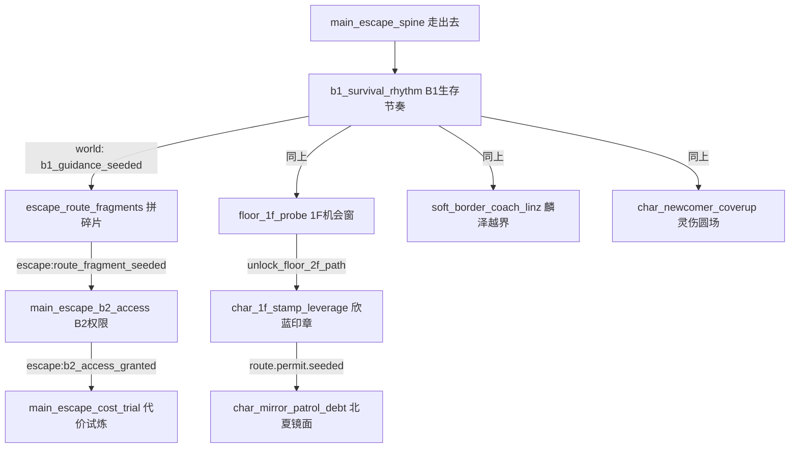

# 前中期节奏 v2：被「走出去」牵引的逃生怪谈

## 原有问题（已针对调整）

- **双主线抢视野**：`main_escape_spine` 与 `main_b1_orientation` 同为 `type: main` 且均 active，任务板与心智模型容易分裂。
- **碎片线过早/过软**：`main_escape_route_fragments` 以 `soft_lead` + `discovered_but_unoffered` 存在，主板 1+2+1 难以稳定展示「下一步」。
- **委托洪峰**：1F 试探、欣蓝印章、北夏镜面、灵伤圆场开局即可见，玩家缺少「为何现在找谁」的因果链。
- **隐藏条件与后果串不一致**：`main_escape_b2_access` / `main_escape_cost_trial` 的 `hiddenTriggerConditions` 与 `worldConsequences` 字符串不对齐，后续主线难靠任务完成自动解锁。

## 新节奏（重排与闸门）

| 阶段 | 玩家应先感到 | 任务/闸门 |
|------|----------------|-----------|
| 0 北极星 | 一切为「走出去」服务 | `main_escape_spine`（唯一主线槽，`surfaceSlot: mainline`） |
| 1 生存稳住 | 先向老刘换「能活的节拍」 | `b1_survival_rhythm`（委托槽，`b1_guidance_seeded` 完成后才释放后续） |
| 2 第一层推进 | 出口从传闻变证据 | `escape_route_fragments`（`hidden` → 完成 B1 后 `available`，显式 `commission` 槽） |
| 3 机会窗 + 关系试探 | 上楼有风险也有物证 | `floor_1f_probe`（`opportunity`）、`soft_border_coach_linz`、`char_newcomer_coverup`（均在 `b1_guidance_seeded` 后出现） |
| 4 小高潮（许可） | 欣蓝把「名单/许可」推到你面前 | `char_1f_stamp_leverage`（需 `unlock_floor_2f_path`，由 1F 试探完成给出） |
| 5 风险升级 | 「能打但未必该打」 | `char_mirror_patrol_debt`（`route.permit.seeded` 后出现，`highRiskHighReward`） |
| 6 路线野心 | B2 权限与代价试炼挂到出口骨架 | `main_escape_b2_access`（`escape:route_fragment_seeded`）、`main_escape_cost_trial`（`escape:b2_access_granted`） |

已 **移除** 与 B1 生存重复的 `soft_survival_coach_liu`（内容并入老刘节奏与主线文案）。

## 任务流转图（简）

## 玩家体验预期

1. **开局先解决什么**：任务板只有「走出去」+「B1 生存节奏」两条硬牵引；叙事上被明确告知：不稳住 B1，楼上情报不会给你真货。
2. **为什么找某个 NPC**：老刘 = 生存与碎片；1F 试探后才有理由找欣蓝换许可；许可落地后北夏的镜面债才浮出水面；灵伤与麟泽在 B1 稳住后同时进入「关系试探」带。
3. **第一次接近出口真相**：完成 B1 并接取/推进 `escape_route_fragments`，`relatedEscapeProgress` 与主线 copy 指向「可验证碎片」。
4. **第一次「能打但未必该打」**：`floor_1f_probe` 的门厅风险文案 + 北夏镜面委托的高风险标记 + `main_escape_cost_trial` 的冲突提示，供 DM 与冲突层落锤。

## 代码与兼容说明

- **ID 变更**：`main_b1_orientation` → `b1_survival_rhythm`；`main_escape_route_fragments` → `escape_route_fragments`。旧存档若仍引用旧 id，需由 DM `task_updates` 迁移（本版本未做自动别名）。
- **新游戏**：`initCharacter` 使用 `activateClaimableHiddenTasks(createStageOneStarterTasks())`，保证闸门与 `worldConsequences` 一致。
- **分区**：`partitionTasksForBoard` 将显式 `surfaceSlot: commission|opportunity` 剔出主线池，避免 `main_` id 误占双主线。
