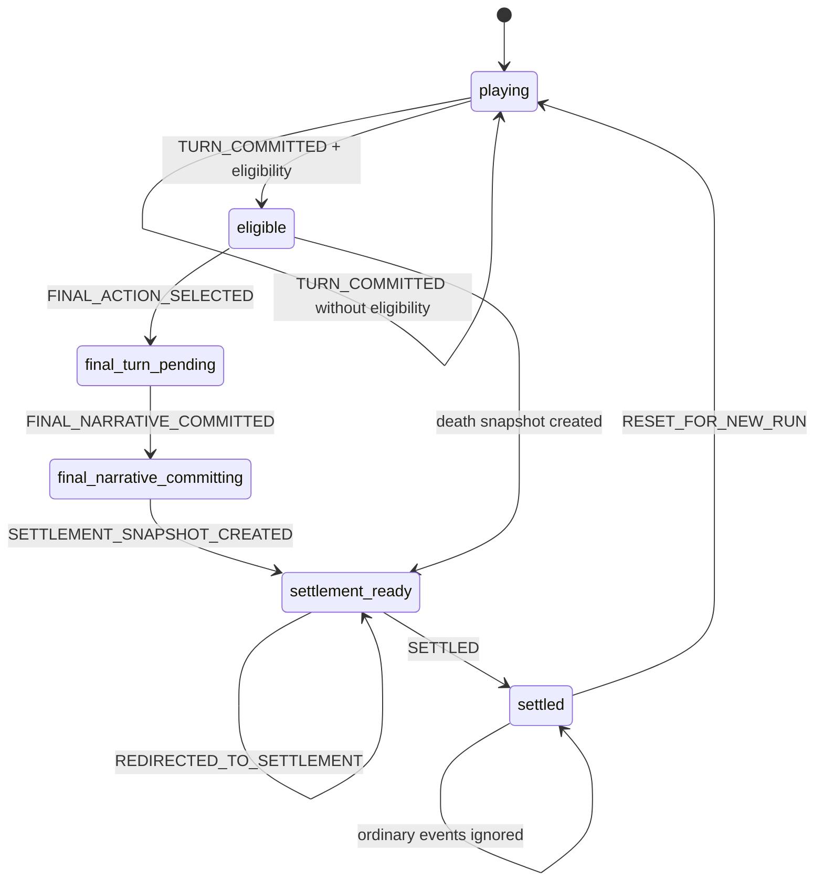

# VerseCraft 结局系统架构

本文描述当前结局系统的长期维护边界。真实代码入口以 `src/lib/endings/*`、`src/lib/escapeMainline/*`、`src/store/useGameStore.ts`、`src/app/play/page.tsx` 和 `src/app/settlement/page.tsx` 为准。

## 核心原则

- 结局是否成立由确定性 TypeScript 代码判断，AI 只负责最终叙事表达。
- 结局状态、最终叙事、结算快照必须可持久化、可回放、可刷新。
- `/settlement` 优先展示 immutable `EndingSettlementSnapshot`；缺失时只走 legacy fallback，并记录观测事件。
- 章节系统、逃离主线、结算页分别负责不同问题，不互相抢夺最终裁决权。

## EndingOutcome

`src/lib/endings/types.ts` 定义的 `EndingOutcome`：

- `death`：死亡结局。
- `doom`：第十日或 240 小时终焉。
- `true_escape`：真正逃离。
- `costly_escape`：付出代价后逃离。
- `false_escape`：假逃离，进入更深循环。
- `abandon`：主动中止或兼容性结算。

优先级在 `src/lib/endings/rules.ts` 的 `ENDING_OUTCOME_PRIORITY` 中维护：

`death > true_escape > costly_escape > false_escape > doom > abandon`

实现上 `evaluateEndingEligibility(...)` 直接按这个顺序返回第一个成立结果。尤其注意：`escaped_*` 已成立时，`doom` 不得覆盖逃离结局；`death` 仍然最高优先级。

## EndingPhase 状态图



状态机入口是 `transitionEndingState(...)`：

- `playing`：正常游玩。
- `eligible`：确定性规则已经判定本局可进入某个结局。
- `final_turn_pending`：玩家已经选择最终动作，等待最终叙事回合。
- `final_narrative_committing`：最终叙事已提交，正在准备 snapshot。
- `settlement_ready`：已拥有 `settlementSnapshot`，可以进入 `/settlement`。
- `settled`：历史记录提交完成或结算已归档，普通事件不能回到游玩态。

`RESET_FOR_NEW_RUN` 是唯一允许从终局状态回到 `playing` 的事件。

## 触发规则

`evaluateEndingEligibility(input)` 是统一结局资格判断入口。

### death

触发条件：

- `resolvedTurn.is_death === true`
- 或 `stats.sanity <= 0`

来源：

- `resolved_turn`
- `player_stats`

死亡可以直接生成结算 snapshot，不要求玩家再做最终选择。`buildEndingDeathContextFromEvaluation(...)` 会保存 `deathCause`、`deathLocation`、`lastAction`。

### true_escape

触发条件：

- `escapeMainline.stage === "escaped_true"`

该 stage 只由逃离主线的最终动作解析推进，不由叙事文本解析。

### costly_escape

触发条件：

- `escapeMainline.stage === "escaped_costly"`

该结局表示出口成立，但存在牺牲、代价、污染、低理智或 cost flag 等代价条件。

### false_escape

触发条件：

- `escapeMainline.stage === "escaped_false"`

该结局表示玩家选择了假出口、镜面出口，或在 false lead 未排除时尝试最终逃离。

### doom

触发条件：

- `survivalHours >= 240`
- 或 `day > 10`
- 或 `day === 10`

实现不要求精确命中 `day=10 hour=0`，因此时间跳过不会漏触发终焉。

### abandon

触发条件：

- `abandonRequested === true`

当前主要作为兼容性和未来主动中止入口保留。

## Escape Final Action 流程

逃离主线最终动作入口是 `resolveEscapeFinalAction(...)`，核心逻辑在 `src/lib/escapeMainline/finalAction.ts`。

流程：

1. 归一化上一帧 `EscapeMainlineState`。
2. 如果 `prev.stage !== "final_window_open"`，返回原状态，保证 escaped/doomed 后不回退。
3. 如果 `finalWindow.expiresTurn` 已过期，进入 `doomed`，并写入 `outcomeHint.outcome = "doom"`。
4. 从结构化字段识别最终动作：
   - 优先读取 `resolvedTurn.escape_final_action`
   - 其次读取 `resolvedTurn.world_flags` / `worldFlags`
   - 最后才用 `playerAction` 中文文本兜底
5. 如果没有最终动作，保持 `final_window_open`，写入 `final_action_missing` blocker。
6. 如果选择假出口、镜面出口，或 false lead 未排除，进入 `escaped_false`。
7. 如果 required conditions 未满足，保持 `final_window_open`，写入 `unmet:*` blockers。
8. 如果存在 sacrifice/cost/pollution/low sanity/cost flag，进入 `escaped_costly`。
9. 否则进入 `escaped_true`。

`computeEscapeOutcomeForSettlement(...)` 是 settlement 兼容读取入口，稳定返回：

- `true_escape`
- `costly_escape`
- `false_escape`
- `doom`
- `none`

## Settlement Snapshot 数据结构

`EndingSettlementSnapshot` 是 `/settlement` 的优先展示源。字段见 `src/lib/endings/types.ts`：

- `v`
- `runId`
- `settlementId`
- `outcome`
- `grade`
- `title`
- `caption`
- `finalNarrative`
- `survivalHours`
- `survivalDay`
- `survivalHour`
- `maxFloorScore`
- `maxFloorLabel`
- `killedAnomalies`
- `keyChoices`
- `obtainedClues`
- `npcEpilogues`
- `worldStateLines`
- `finalChoiceLabel`
- `deathCause`
- `deathLocation`
- `lastAction`
- `createdAt`
- `writingMarkdown`

生成入口：

- `buildSettlementSnapshot(...)`
- `buildEndingSettlementSnapshotFromStore(...)`
- `evaluateEndingAfterTurnForStore(...)`

评级、楼层和结算展示规则仍以 `src/lib/settlement/rules.ts` 为唯一口径。`src/lib/endings/summary.ts` 只负责把 Ending 领域数据组装成 immutable snapshot，并调用 settlement rules，不另建第二套评级规则。

## 与 Chapter System 的边界

章节系统入口：

- `src/lib/chapters/definitions.ts`
- `src/lib/chapters/progress.ts`
- `src/lib/chapters/engine.ts`
- `src/features/play/chapters/*`

边界：

- chapter completion 只判断章节目标是否闭环，不判断本局是否通关。
- `advanceChapterBeats(...)` 使用结构化回合信号推进 beat，不解析 narrative。
- `shouldCompleteChapter(...)` 保留 `closeDecision`，同时有 `localReady` 兜底。
- 章节完成只写 `chapterState`、summary、`pendingChapterEndId` 和下一章解锁。
- 结局触发后 `/play` 禁止继续普通 options regen，章节完成不会覆盖结局状态。

## 与 /api/chat 的边界

`/api/chat` 仍是 SSE + DM JSON 生成链路，不承担通关裁决。

允许 `/api/chat` 提供：

- `is_death`
- `death_cause`
- `player_location`
- `world_flags`
- `escape_final_action`
- `ending_finale`
- `narrative`
- `options`

禁止把这些交给 AI 决定：

- 是否已经通关。
- 最终 outcome 的优先级。
- 是否应跳转 `/settlement`。
- 是否创建 settlement snapshot。

最终叙事协议：

- `/play` 在 `eligible` 且非 death 时显示 `FinalChoicePanel`。
- 玩家选择后发起带 `ENDING_FINALE_SYSTEM_PROMPT_TAG` 的系统回合。
- AI 必须返回 `ending_finale`；解析失败时使用 `buildLocalEndingFinaleFallback(...)`。
- 最终回合 options 只能是 `["查看结算","导出本局写作稿","回看全文"]`。

## 幂等策略

核心 key：

```text
runId + outcome + detectedAtTurn
```

对应函数：

- `buildEndingIdempotencyKey(...)`
- `buildEndingTelemetryIdempotencyKey(...)`

幂等规则：

- 同一个 `runId + outcome + detectedAtTurn` 只创建一次 settlement branch。
- `transitionEndingState(...)` 已有 `settlementSnapshot` 且 incoming key 相同，则返回原状态。
- `redirectedAt` 已存在时不重复 `router.push("/settlement")`。
- `settledAt` 已存在时 `/settlement` 不重复提交 history。
- `/settlement` 刷新后继续展示同一个 snapshot，不重新计算 outcome。

## 持久化与兼容

持久化位置：

- `GameState.endingState`
- save slot data
- `RunSnapshotV2.endingState`
- `RunSnapshotV2.endingSettlementSnapshot`

旧存档兼容：

- 缺少 `endingState` 时迁移为 `createInitialEndingState()`。
- 缺少 snapshot 但访问 `/settlement` 时走 legacy fallback，source 标记为 `legacy_fallback`。
- legacy fallback 会记录 `ending_blocked`，blocker 为 `settlement_snapshot_missing`。

## 观测与 Debug

新增 telemetry events：

- `ending_eligible_detected`
- `ending_final_choice_shown`
- `ending_final_choice_selected`
- `ending_final_narrative_committed`
- `ending_settlement_snapshot_created`
- `ending_redirected_to_settlement`
- `ending_settlement_viewed`
- `ending_settlement_history_submitted`
- `ending_blocked`

payload 至少包含：

- `runId`
- `outcome`
- `endingPhase`
- `detectedAtTurn`
- `idempotencyKey`
- `reasons`
- `blockers`
- `escapeStage`
- `survivalHours`
- `source`

开发调试入口：

- `src/lib/debug/narrativeSystemsDebugRing.ts`
- `src/features/play/components/NarrativeSystemsDebugPanel.tsx`

debug ring 只保留最近 20 条摘要，默认生产不可见，不记录隐藏剧情真相正文。
