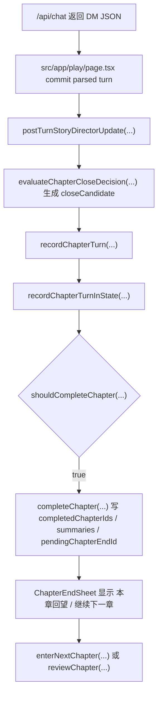
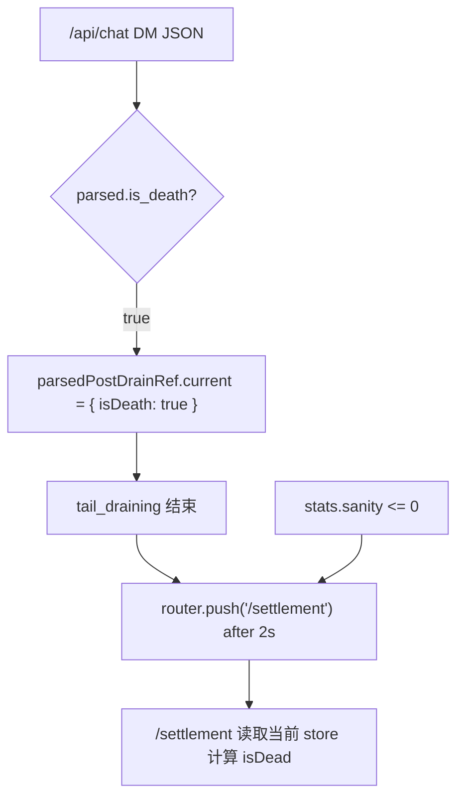
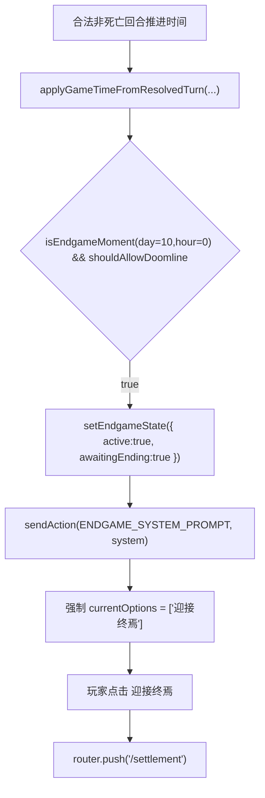
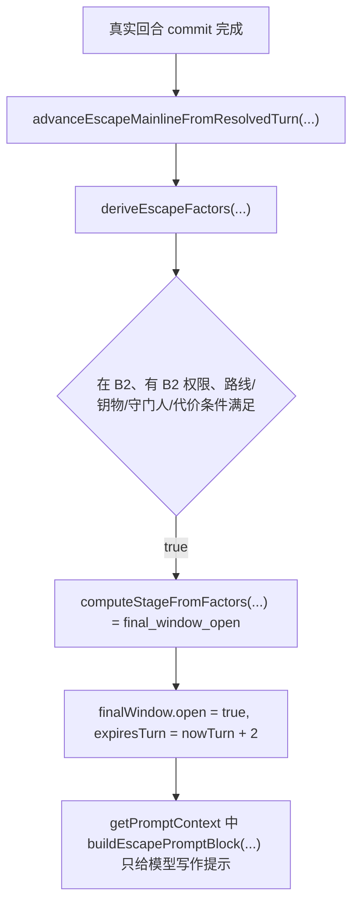
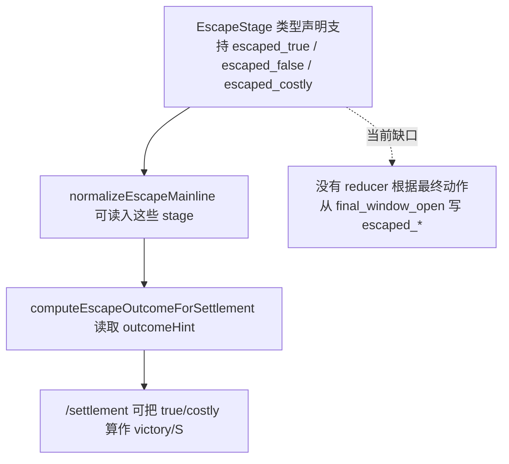
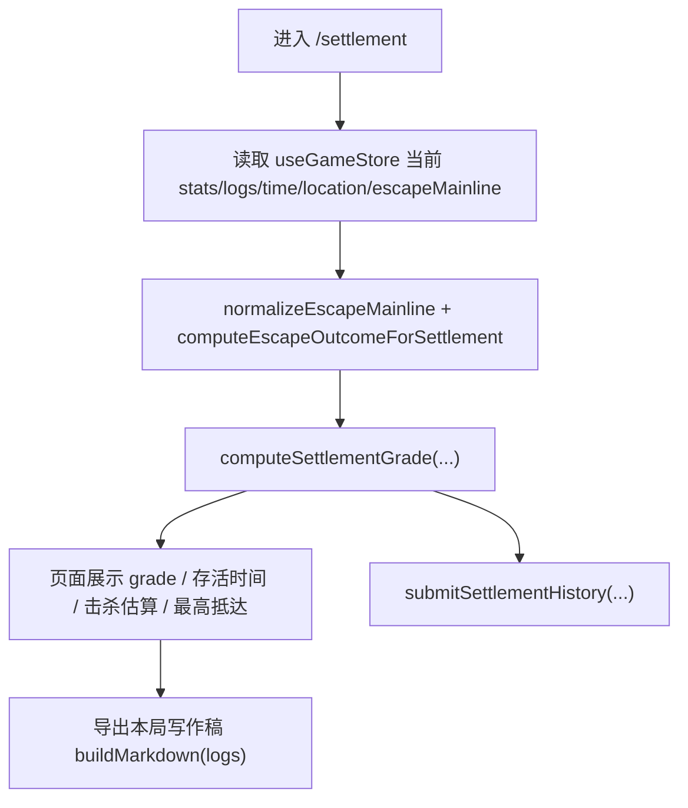

# VerseCraft 结局系统审计报告

审计日期：2026-05-08
范围：阶段 0，只读审计现有章节、逃离主线、终局、死亡与结算链路；本报告不包含业务代码改动。

## 0. 结论摘要

当前仓库已经有若干“结束类”机制，但它们还不是同一个可回放、可持久化、幂等的结局系统：

- `chapter_complete` 是最完整的局部闭环：`StoryDirector` 给出 `closeCandidate`，`recordChapterTurn` 触发章节完成，UI 显示章末回望，但它只进入下一章，不进入 `/settlement`。
- `death` 目前主要是客户端即时跳转：`parsed.is_death` 或理智归零会在 `/play` 推到 `/settlement`，但没有统一生成不可变死亡结算快照，也没有可靠地把 `is_death` 写成 store 的死亡事实。
- `doom` 目前是第 10 日 0 时的前端终局态和一次系统回合文案请求，不会确定性写入 `escapeMainline.stage = "doomed"` 或 `outcomeHint = "doom"`。
- `final_window_open` 可以由确定性逃离主线推导出来，但当前没有后续确定性 reducer 把最终动作提交为 `escaped_true` / `escaped_costly` / `escaped_false`。
- `/settlement` 是已有展示页，但它直接读取当前 Zustand store 计算结果，而不是读取一次性冻结的 immutable settlement snapshot。

## 1. 当前结束类事件链路图

### 1.1 `chapter_complete`

证据：

- 章节定义只有 `chapter-1`、`chapter-2` 两章，包含 `minTurns`、`beats`、`nextChapterId` 等元数据：`src/lib/chapters/definitions.ts:6-54`。
- beat 推进只在 `advanceChapterBeats` 中根据 turn/narrative/stateChange 自动完成前几类 beat：`src/lib/chapters/progress.ts:41-63`。
- `shouldCompleteChapter` 要求 `runtime.closeDecision` 的多个布尔条件全部满足，且 `confidence >= 0.75`：`src/lib/chapters/engine.ts:69-87`。
- 完成后写入 `completedChapterIds`、`summariesByChapterId`、`pendingChapterEndId`：`src/lib/chapters/engine.ts:89-138`。
- `/play` 在真实回合 commit 后调用 `postTurnStoryDirectorUpdate` 和 `recordChapterTurn`：`src/app/play/page.tsx:3346-3357`、`src/app/play/page.tsx:3399-3439`。
- UI 通过 `ChapterEndSheet` 展示回望和下一章入口：`src/features/play/chapters/ChapterEndSheet.tsx:30-87`。

### 1.2 `death`

证据：

- `/play` 在 tail drain 完成后，如果 `pending.isDeath` 或最终理智 `<= 0`，延迟 2 秒跳转 `/settlement`：`src/app/play/page.tsx:661-670`。
- 另有 `sanity <= 0` effect，也会延迟跳转 `/settlement`：`src/app/play/page.tsx:1140-1144`。
- `parsed.is_death` 最后只进入 `parsedPostDrainRef`，章节记录时会传 `isDeath` 并抑制章节完成：`src/app/play/page.tsx:3401-3405`、`src/app/play/page.tsx:3448-3452`。
- store 内有 `recordDeathForRevive` / `deathCount` / `reviveContext`，但 `/play` 当前搜索不到对 `recordDeathForRevive` 的调用；函数本身会写死亡地点、死因、掉落与复活锚点：`src/store/useGameStore.ts:1284-1326`。
- `/settlement` 判断死亡只看 `stats.sanity <= 0`：`src/app/settlement/page.tsx:100-108`。

### 1.3 `doom`

证据：

- `isEndgameMoment` 只匹配 `day === 10 && hour === 0`：`src/features/play/endgame/endgame.ts:10-12`。
- `shouldAllowDoomline` 只屏蔽 `escaped_true` / `escaped_false` / `escaped_costly`：`src/features/play/endgame/endgame.ts:18-22`。
- `/play` 在 `nextTime.day >= 10` 内部，只有 `isEndgameMoment(nextTime)` 为真时才触发 doomline：`src/app/play/page.tsx:3316-3332`。
- 触发后 `awaitingEnding` effect 自动发一次 `ENDGAME_SYSTEM_PROMPT` 系统回合：`src/app/play/page.tsx:1164-1170`。
- 终局系统回合只强制文案字数与唯一选项，不写 `escapeMainline.stage = "doomed"`：`src/app/play/page.tsx:2923-2934`。
- 点击唯一选项才进入 `/settlement`：`src/app/play/page.tsx:3503-3512`。

### 1.4 `final_window_open`

证据：

- `/play` 每个真实回合 commit 后推进逃离主线：`src/app/play/page.tsx:3362-3370`。
- `deriveEscapeFactors` 从位置、worldFlags、inventory、codex trust、任务、memory 推导逃离条件：`src/lib/escapeMainline/derive.ts:33-101`。
- `computeStageFromFactors` 在 `pendingFinalAction && reqAllMet` 时进入 `final_window_open`：`src/lib/escapeMainline/reducer.ts:85-105`。
- `finalWindow` 设置 `open/dueTurn/expiresTurn/locationId/hint`：`src/lib/escapeMainline/reducer.ts:141-151`。
- prompt block 明确写着“只供写作”，不会提交结局事实：`src/lib/escapeMainline/prompt.ts:20-27`。

### 1.5 `true_escape` / `costly_escape` / `false_escape`

证据：

- 类型层定义了 `escaped_true`、`escaped_false`、`escaped_costly`：`src/lib/escapeMainline/types.ts:1-11`。
- reducer 只保留已有 escaped stage；没有从 `final_window_open` 进入 escaped stage 的分支：`src/lib/escapeMainline/reducer.ts:96-105`。
- `outcomeHint` 有 escaped 分支，但只有 `nextStage` 已经是 escaped 时才会产生：`src/lib/escapeMainline/reducer.ts:153-160`。
- 当前测试只覆盖能推进到 `final_window_open`，以及手动 normalize 后 settlement outcome 能读取 `costly_escape`：`src/lib/escapeMainline/escapeMainline.test.ts:39-60`、`src/lib/escapeMainline/escapeMainline.test.ts:111-113`。

### 1.6 `settlement`

证据：

- `/settlement` 直接读取当前 store 的 `stats/logs/time/playerLocation/historicalMaxFloorScore/escapeMainline`：`src/app/settlement/page.tsx:91-108`。
- 结算评级规则在 `computeSettlementGrade`，死亡强制 E，true/costly escape 强制 S：`src/lib/settlement/rules.ts:10-25`。
- 页面只展示 grade caption、存活时间、消灭诡异、最高抵达、返回首页和导出按钮：`src/app/settlement/page.tsx:226-273`。
- 写作稿直接从当前 `logs` 构造：`src/app/settlement/page.tsx:36-48`、`src/app/settlement/page.tsx:117-118`。

## 2. 每条链路现状表

| 事件 | 当前触发条件 | 写入状态 | UI 表现 | 是否跳转 `/settlement` |
| --- | --- | --- | --- | --- |
| `chapter_complete` | 真实合法非 system 回合后，`recordChapterTurnInState` 进度满足 `minTurns`，且 `StoryDirector.closeCandidate` 全部条件通过。见 `src/lib/chapters/engine.ts:69-87`、`src/store/useGameStore.ts:1098-1115`。 | 写 `chapterState.progressByChapterId[chapterId].status = "completed"`、`completedChapterIds`、`summariesByChapterId`、`pendingChapterEndId`、下一章 title candidate。见 `src/lib/chapters/engine.ts:102-138`。 | `ChapterEndSheet` 覆盖行动区，显示“本章回望 / 继续下一章 / 回看本章”。见 `src/features/play/chapters/ChapterEndSheet.tsx:30-87`。 | 否。只进入下一章或回看。 |
| `death` | `parsed.is_death === true` 或最终 `stats.sanity <= 0`。见 `src/app/play/page.tsx:661-670`、`src/app/play/page.tsx:1140-1144`。 | `parsed.is_death` 本身没有统一写入 immutable death record；理智伤害只扣 `stats.sanity`。`recordDeathForRevive` 存在但未接入当前 `/play` death 跳转。 | 回合叙事 tail drain 后延迟跳转；期间可能仍短暂保留本回合 options。 | 是，客户端 `router.push("/settlement")`。 |
| `doom` | 时间推进后恰好 `day=10,hour=0` 且未 escaped。见 `src/features/play/endgame/endgame.ts:10-22`、`src/app/play/page.tsx:3316-3332`。 | 只写 React 本地 `endgameState` 和 `currentOptions=["迎接终焉"]`；没有写 `escapeMainline.stage="doomed"`。 | 终局 overlay、行动区 busy 文案、唯一选项“迎接终焉”。见 `src/app/play/page.tsx:828-833`、`src/app/play/page.tsx:3921-3955`。 | 最终由玩家点击唯一选项跳转。 |
| `final_window_open` | 在 B2、具备 B2 权限、关键钥物、守门人认可、代价试炼，并且没有 blockers。见 `src/lib/escapeMainline/derive.ts:44-99`、`src/lib/escapeMainline/reducer.ts:85-105`。 | 写 `escapeMainline.stage="final_window_open"`、`finalWindow.open=true`、`pendingFinalAction`。见 `src/lib/escapeMainline/reducer.ts:141-185`。 | 目前没有专用 UI；只进入 prompt block 影响后续 AI 写作。 | 否。 |
| `true_escape` | 类型和 selector 支持，但当前没有确定性触发路径。 | 只有已有 stage/outcomeHint 被 normalize 时能保留。见 `src/lib/escapeMainline/reducer.ts:96-105`、`src/lib/escapeMainline/reducer.ts:153-160`。 | 无专用 `/play` UI。 | 只有外部已写入 outcome 后，`/settlement` 会算 S/victory。 |
| `costly_escape` | 同上。 | 同上。 | 无专用 `/play` UI。 | 同上，`/settlement` 会算 S/victory。 |
| `false_escape` | 同上。 | 同上。 | 无专用 `/play` UI。 | `/settlement` 可读取 outcome，但不会按 victory/S 特判。 |
| `settlement` | death、sanity 归零、doom 选项、设置面板直接结束均可到达。见 `src/app/play/page.tsx:669`、`src/app/play/page.tsx:1142`、`src/app/play/page.tsx:3509`、`src/app/play/page.tsx:3621`。 | 页面打开时从当前 store 计算并提交 history；不是事前冻结 snapshot。见 `src/app/settlement/page.tsx:91-143`。 | 结算纸页、评级、三项统计、导出写作稿。 | 已在该页。 |

## 3. 高风险问题列表

### P0-1：章节 beat 不完整推进，完成时强制补齐

`advanceChapterBeats` 只按计数自动推进到第 4 个 beat，后续如第一章的 `hook`、第二章的 `next-risk` 没有独立确定性条件；`completeChapter` 会直接把 definition 内所有 beat 标成完成。见 `src/lib/chapters/progress.ts:41-63`、`src/lib/chapters/engine.ts:102-107`。

风险：章节回望看起来完成了所有文学 beat，但系统并不能证明“章末钩子 / 下一风险”真的发生过。未来结局系统如果复用 chapter beat 作为 escape/ending 条件，会得到过度乐观的状态。

### P0-2：chapter completion 过度依赖 `closeDecision`

当前测试明确要求“仅靠进度计数不完成章节”：`src/lib/chapters/engine.test.ts:100-126`。这保护了文学节奏，但也意味着只要 `StoryDirector.closeCandidate` 丢失、不同步或因 readable pause / lore conflict 为 false，章节会无限停留。

风险：如果最终章、逃离章或死亡前章也沿用这套机制，确定性通关条件会被“章节是否自然收束”的 reasoner 状态阻塞。

### P0-3：`final_window_open` 不能稳定进入 `escaped_*`

当前 reducer 能确定性打开 final window，但没有提交最终动作的 reducer。`resolvedTurn` 参数被传入 `advanceEscapeMainlineFromState`，但当前实现没有使用它决定 `escaped_true` / `escaped_costly` / `escaped_false`。见 `src/lib/escapeMainline/reducer.ts:108-185`。

风险：玩家满足所有逃离条件后，系统最多进入 `final_window_open`，后续是否“写成逃离”只会进入模型表达层，不会成为可测试、可持久化的游戏事实。

### P0-4：Doomline 可能因时间跳过 `day=10,hour=0` 而漏触发

时间推进支持 `heavy=1.35`、`dangerous=1.65` 小时分数，`splitProgress` 可产生多个整点进位；`applyWholeGameHourTicks` 会逐小时推进。见 `src/lib/time/timeRules.ts:19-25`、`src/lib/time/timeBudget.ts:29-36`、`src/store/useGameStore.ts:316-345`。但 `/play` 只在最终 `nextTime` 恰好 `day=10,hour=0` 时触发 doomline：`src/app/play/page.tsx:3316-3332`。

风险：例如第 9 日 23 时且 pending hour fraction 较高，`dangerous` 行动可能直接落到第 10 日 1 时；`nextTime.day >= 10` 为真，但 `isEndgameMoment` 为 false，于是 doomline 不触发。

### P0-5：`/settlement` 依赖易变 store，而非 immutable snapshot

`/settlement` 读取当前 Zustand store 现场数据计算等级、结果、写作稿：`src/app/settlement/page.tsx:91-118`。它没有读取 `settlementSnapshotId`、runSnapshot 中的冻结结算对象，也没有在跳转前生成一次不可变快照。

额外风险：`saveGame` 构建 `RunSnapshotV2` 时没有把当前 `s.escapeMainline` 传入 `buildRunSnapshotV2`，builder 会在缺省时写默认 escape：`src/store/useGameStore.ts:3194-3257`、`src/lib/state/snapshot/builder.ts:71-135`。因此逃离进度持久化路径也有丢失风险。

### P0-6：死亡结算没有统一死亡事实

`parsed.is_death` 会导致跳转，但 `/settlement` 用 `stats.sanity <= 0` 判断 `isDead`：`src/app/play/page.tsx:661-670`、`src/app/settlement/page.tsx:100-108`。如果模型返回 `is_death: true` 但理智仍大于 0，结算页可能不把本局判为死亡。

风险：死亡叙事、死亡统计、history outcome、成就和导出稿会互相不一致。

### P0-7：结局触发后仍可能保留或生成普通 options

doomline active 时 `requestFreshOptions` 会被挡住，且系统回合强制唯一选项：`src/app/play/page.tsx:1638-1641`、`src/app/play/page.tsx:2923-2934`。但 death 和 final window 没有同等冻结：

- death 回合如果 DM 自带普通 options，`deliveryDecision.action === "commit"` 会先写 `currentOptions`，再等 tail drain 跳转。见 `src/app/play/page.tsx:2911-2937`、`src/app/play/page.tsx:3448-3452`。
- `final_window_open` 没有 UI 锁定或 options 策略，仍走普通 options 交付。

风险：死亡/终局/逃离达成后，玩家短暂看到普通行动，甚至存档中保留普通 options，破坏结局不可逆感。

### P0-8：结局幂等性不足

当前有一些局部防重：

- doomline 用组件内 `endgameTriggeredRef` 防止同一页面重复触发：`src/app/play/page.tsx:511-515`、`src/app/play/page.tsx:3325-3332`。
- settlement history 上传用 `hasUploadedRef` 防止同一 mount 重复提交：`src/app/settlement/page.tsx:87-88`、`src/app/settlement/page.tsx:119-143`。

但这些都不是持久化幂等键。刷新 `/settlement`、重新进入 `/play`、或者 death 和 sanity effect 同时安排跳转，都没有统一的 `endingId/runId/settlementSnapshotId` 来证明“本局已经结算”。

### P1-1：结算页表达不足以区分 `doom` / `false_escape` / `costly_escape`

`computeSettlementGrade` 只对 true/costly escape 给 S；`getSettlementGradeCaption` 对 `doom` 的特殊文案只在 grade 未提前命中其他分支时才可能出现。见 `src/lib/settlement/rules.ts:17-35`。页面也不展示 `escapeOutcome`、关键条件、结局类型、最终叙事标题或代价说明。

风险：即使后续写入 `false_escape` / `doom`，玩家也很难理解自己到底达成了哪种结局。

### P1-2：现有 E2E 没覆盖核心结局路径

当前 `chapter-flow.spec.ts` 覆盖章末、回看、下一章、移动端尺寸与 mock `/api/chat`：`e2e/chapter-flow.spec.ts:381-495`。`mobile-settings-ui.spec.ts` 只覆盖设置面板直接结束能打开 settlement：`e2e/mobile-settings-ui.spec.ts:332-370`。

缺口：没有 mock `/api/chat` 验证 death -> settlement、doom -> final narrative -> settlement、final_window_open -> escaped_* -> settlement，也没有验证 settlement snapshot 在刷新后不变。

## 4. 推荐实施顺序

### P0 必须修复

1. 新增统一 `EndingState` / `SettlementSnapshot` 类型与 reducer，放在 `src/lib/endings/*` 或 `src/lib/settlement/*`，由确定性代码写入 `endingId`、`kind`、`outcome`、`triggerTurn`、`triggeredAt`、`finalNarrativeLogIndex`、`frozenMetrics`。
2. 在 `/play` 统一接入 death / doom / escape 的 ending commit，不再由多个 `router.push("/settlement")` 分散触发。
3. 补 `escapeMainline` 从 `final_window_open` 到 `escaped_true` / `escaped_costly` / `escaped_false` 的确定性 reducer：输入来自结构化状态和玩家最终动作，不由 AI 决定。
4. 修复 doomline 判断，从“最终时间是否等于 day10 hour0”改为“本回合时间区间是否跨过 doom threshold”，避免跳过。
5. 修复 death 事实写入：`parsed.is_death` 必须冻结为 `ending.kind = "death"`，settlement 不再只靠 `stats.sanity` 推断。
6. 修复持久化：`saveGame` 必须把当前 `escapeMainline` 和新的 `ending/settlementSnapshot` 写入 `RunSnapshotV2` / save slot。
7. 增加结局冻结策略：进入 ending committed 后清空或替换普通 options，禁止 options regen，禁止重复 sendAction。
8. 增加单元测试：ending reducer、doom threshold crossing、escape final action reducer、death snapshot、settlement rules。
9. 增加 Playwright mock E2E：death、doom、true_escape、costly_escape、false_escape、settlement refresh replay。

### P1 体验增强

1. `/settlement` 展示明确结局类型：死亡、终焉、真正逃离、代价逃离、假逃离。
2. 展示冻结结算摘要：最终地点、最终时间、完成条件、未完成条件、代价、关键选择回顾、最终叙事摘录。
3. 保留导出写作稿，但使用 snapshot 中冻结的 logs/markdown，避免 store 后续变化影响导出。
4. 对 final window 增加移动端阅读壳层内提示，但不要做任务栏/进度条式 UI；保持文学化、可回顾。
5. death / doom / escape 到 settlement 之间增加统一的短过渡态，避免玩家看到普通 options。

### P2 观测与长期维护

1. 增加 analytics 事件：`ending_committed`、`settlement_snapshot_created`、`settlement_viewed_from_snapshot`、`ending_duplicate_suppressed`。
2. 给每个 ending snapshot 写 `schemaVersion` 和迁移函数，支持旧存档进入 settlement。
3. 增加结局回放 fixture：固定输入 store + fixed mocked DM，断言 ending snapshot 完全一致。
4. 增加 settlement history 幂等键：基于 `runId + endingId`，而不是页面 mount 状态。
5. 给 `/api/chat` 添加 ending 状态下的 contract guard：ending committed 后不再生成主回合 options。

## 5. 下一阶段可执行任务清单

1. 设计 `src/lib/endings/types.ts` 与 `src/lib/endings/reducer.ts`：先只覆盖 death、doom、escape 三类，不接 UI。
2. 给 reducer 写单元测试：重复 commit 同一 ending 不变；death 优先级；doom threshold crossing；final window 提交 true/costly/false。
3. 修改 `RunSnapshotV2` schema 与 `saveGame` 输入，确保 `escapeMainline` 和 `endingState` 都能持久化、迁移和恢复。
4. 在 `/play` commit 后统一调用 `commitEndingIfNeeded(...)`，返回 `settlementSnapshot` 后再跳 `/settlement`。
5. 修改 `/settlement`：优先读取 frozen snapshot，缺失时才做旧 store fallback。
6. 增加 Playwright mock E2E：死亡结算、终焉结算、真正逃离、代价逃离、假逃离、刷新结算页仍一致。
7. 最后再做 settlement UI 文案增强，避免先改展示而底层事实仍不稳定。
