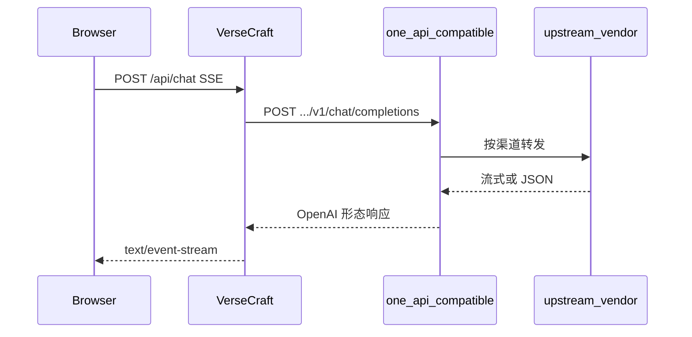

# 本地将 VerseCraft 接到 one-api（傻瓜步骤）

本文说明如何在**本机**让 VerseCraft 通过 **OpenAI 兼容网关**（习惯称 one-api / New API 等）访问大模型。完整变量说明仍以 [`ai-gateway.md`](ai-gateway.md) 为准。

## 你要完成什么

让浏览器里的 VerseCraft（`pnpm dev` 默认 **666** 端口）能把对话请求发到**本机或局域网**上的网关，且网关里配置的**模型名字符串**与 VerseCraft 的 `AI_MODEL_*` **完全一致**。

## 架构（对接成功后）



## 端口约定（避免冲突）

| 服务 | 典型端口 | 说明 |
|------|----------|------|
| VerseCraft | **666** | `package.json` 中 `pnpm dev` |
| one-api | **3000**（示例） | 以你实际启动为准；勿与 666 混用同一端口 |

VerseCraft 里填：`AI_GATEWAY_BASE_URL=http://127.0.0.1:3000`（无尾斜杠即可，应用会自动补 `/v1/chat/completions`）。

## 方案对比（选一种即可）

| 维度 | 方案甲：自己装 one-api + 改 `.env.local`（**推荐**） | 方案乙：Docker Compose 一体起网关 |
|------|----------------------------------|--------------------------------|
| 操作量 | 较少：装网关 + 控制台配渠道 + 填环境变量 | 中等：还要维护 compose 与镜像版本 |
| 仓库维护 | 无 | 高（镜像升级、环境变量变更） |
| 适用 | 绝大多数本地开发者 | 团队强制统一本地拓扑时 |

**本仓库默认采用方案甲**；方案乙仅在你已有团队级 `docker-compose` 时自行套用，不在此仓库维护官方 compose 片段（避免与上游 breaking change 绑定）。

---

## 方案甲：推荐路径（逐步做）

### 第 0 步：安装并启动 one-api

请按你所使用的 **one-api / New API 发行版官方文档**安装（常见为 Docker 或二进制）。启动后应能在浏览器打开管理界面（例如 `http://127.0.0.1:3000`，**以实际为准**）。

> VerseCraft **不会**替你安装或配置 one-api；以下步骤均在 **one-api 控制台**完成。

### 第 1 步：创建访问令牌

1. 登录 one-api 管理后台。  
2. 找到 **令牌 / API Key / 访问密钥** 一类菜单，**新建令牌**。  
3. 复制生成的字符串 → 写入 VerseCraft 的 **`AI_GATEWAY_API_KEY`**（仅服务端，勿写 `NEXT_PUBLIC_*`）。

### 第 2 步：配置至少一条上游渠道

1. 在后台找到 **渠道 / Channel**（名称因版本略有不同）。  
2. 新增渠道：选择你的上游类型（如 OpenAI 兼容、各云厂商等），填入**上游地址与上游密钥**（密钥留在 one-api，不要写进 VerseCraft）。  
3. 保存并确认渠道状态为可用（部分控制台有「测试」按钮）。

### 第 3 步：让「模型名」与 VerseCraft 对齐（最关键）

VerseCraft 只把 **字符串** 发给网关，例如 `AI_MODEL_MAIN=vc-main`，则 one-api 中必须存在名为 **`vc-main`** 的部署/模型映射（名称与大小写**一致**），并指向第 2 步的渠道。

建议四个逻辑角色各对应一个模型 id（可与 `.env.example` 一致，也可自定义，但 **四处必须一致**）：

| VerseCraft 环境变量 | 示例值 | one-api 中需存在的同名模型 |
|---------------------|--------|----------------------------|
| `AI_MODEL_MAIN` | `vc-main` | `vc-main` |
| `AI_MODEL_CONTROL` | `vc-control` | `vc-control` |
| `AI_MODEL_ENHANCE` | `vc-enhance` | `vc-enhance` |
| `AI_MODEL_REASONER` | `vc-reasoner` | `vc-reasoner` |

若你暂时只配一条上游，可让四个名字在 one-api 里**都映射到同一渠道**（具体菜单名称依控制台为准）。

### 第 4 步：填写 VerseCraft `.env.local`

1. 若还没有：从模板复制  
   `cp .env.example .env.local`  
2. 至少配置（可与 [`../.env.local.oneapi.example`](../.env.local.oneapi.example) 对照复制）：

```env
AI_GATEWAY_PROVIDER="oneapi"
AI_GATEWAY_BASE_URL="http://127.0.0.1:3000"
AI_GATEWAY_API_KEY="你在第1步复制的令牌"
AI_MODEL_MAIN="vc-main"
AI_MODEL_CONTROL="vc-control"
AI_MODEL_ENHANCE="vc-enhance"
AI_MODEL_REASONER="vc-reasoner"
```

3. 同时保证 `DATABASE_URL`、`AUTH_SECRET` 等本地必填项已按 [`local-development.md`](local-development.md) 填写。

**减负方式（可选）**：在仓库根目录执行 `pnpm patch:env-local-ai`，按提示输入网关地址与令牌（会先提示备份 `.env.local`）。

### 第 5 步：终端验证（不启动游戏也能查错）

在 **VerseCraft 仓库根目录**执行：

```bash
pnpm verify:ai-gateway
```

- 若缺项，按终端提示补全变量。  
- 需要 CI 式严格失败：`VERIFY_AI_GATEWAY_STRICT=1 pnpm verify:ai-gateway`

可选（会发起**极小**真实请求，可能产生微量费用）：

```bash
pnpm probe:ai-gateway
```

### 第 6 步：启动游戏并试一句

```bash
pnpm dev
```

浏览器打开 **http://localhost:666**（或 http://127.0.0.1:666），进入游玩流程，发送一句对话。若仍走降级文案，见下文排障表。

---

## 开发者专属环节小结（必须人工时只看这段）

1. **令牌** → `AI_GATEWAY_API_KEY`  
2. **渠道 + 上游密钥** → 只在 one-api 后台  
3. **模型名字符串** → one-api 与 `AI_MODEL_*` **逐字相同**  
4. **验证** → `pnpm verify:ai-gateway` → `pnpm probe:ai-gateway` → `pnpm dev`

---

## 常见故障（对照查）

| 现象 | 处理 |
|------|------|
| `pnpm verify:ai-gateway` 显示网关或 MAIN 缺失 | 检查 `.env.local` 是否在**仓库根目录**；键名是否与 `.env.example` 完全一致 |
| 连接被拒绝 / fetch failed | one-api 是否已启动；`AI_GATEWAY_BASE_URL` 端口是否与实际一致；可本机 `curl` 网关根路径试连通 |
| 401 / 403 | 令牌错误或未生效；在 one-api 重新生成令牌并更新 `AI_GATEWAY_API_KEY` |
| 模型不存在 / model not found | one-api 中模型 id 与 `AI_MODEL_*` 不一致；或渠道未绑定到该模型 |
| 游戏内长期「未配置大模型」降级 | `anyAiProviderConfigured` 为 false：缺 URL、Key、`AI_MODEL_MAIN` 之一 |
| 有输出但 JSON/SSE 异常 | 上游是否支持流式或 `json_object`；见 [`troubleshooting-ai.md`](troubleshooting-ai.md) |

---

## 相关链接

- 网关与切模型：[`ai-gateway.md`](ai-gateway.md)  
- 本地通用开发：[`local-development.md`](local-development.md)  
- 环境变量总表：[`environment.md`](environment.md)
