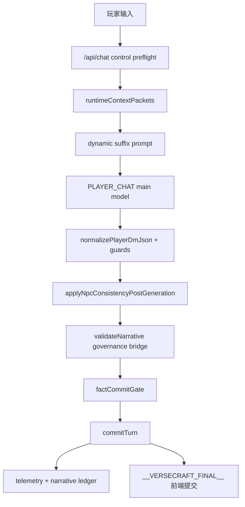

# VerseCraft 叙事治理 v1

本文记录 PR-1 到 PR-4 的总集成边界。目标不是把模型提示词加长，而是把在线回合收束成可回滚、可观测、可测试的叙事治理工作流。

## 架构图

## 新增模块

- `src/lib/narrativeStyle/*`: VerseCraft 自有文风协议与启发式 Style Validator。
- `src/lib/npcKnowledge/*`: NPC Belief Graph、Knowledge Packet、NPC 知识边界校验。
- `src/lib/npcRelations/*`: NPC Relation Graph，决定是否可提及其他 NPC 与共享事实。
- `src/lib/worldFacts/*`: World Fact Registry、Unsupported Fact Detector、Fact Commit Gate。
- `src/lib/narrativeGovernance/narrativeGovernanceGoldenScenes.test.ts`: 跨模块 golden regression。

## Prompt Packet 顺序

`src/lib/playRealtime/playerChatSystemPrompt.ts` 负责 dynamic suffix 的最终排序。PR-4 的目标顺序是：

1. `turn_mode_policy_packet`: 决定本回合是否需要选择。
2. `narrative_style_bible_packet`: 约束怎么写，只管文风。
3. `narrative_continuity_packet`: 承接上一段与玩家动作。
4. `npc_knowledge_packet`: 约束 NPC 能知道什么。
5. `actor_personality_packet`
6. `actor_foreshadow_packet`
7. `narrative_task_mode_packet`
8. `action_time_cost_packet`
9. `world_fact_audit_v1`
10. `reality_constraint_packet`
11. `protagonist_anchor_packet`
12. anti-cheat/control augmentation

`src/lib/playRealtime/runtimeContextPackets.ts` 将 actor constraint bundle 提前放入 runtime JSON，使 `npc_knowledge_packet` 和人格/伏笔/任务/时间 packet 在世界 lore dump 之前出现。`src/lib/playRealtime/actorConstraintPackets.ts` 把 `npc_knowledge_packet` 放在 bundle 首位，并受 `VERSECRAFT_ENABLE_NPC_BELIEF_GRAPH` 控制。

## Validator

`src/lib/turnEngine/validateNarrative.ts` 是统一汇总点。它仍保留原有规则，并接入：

- Style Validator: `style_drift`、`mechanical_exposition`、`narrative_style_bridge`。
- NPC Knowledge Validator: `npc_knows_forbidden_fact`、`npc_mentions_unknown_npc`、`npc_relationship_fabrication`、`floor_knowledge_overreach`、`root_cause_leak`、`rumor_stated_as_fact`。
- Unsupported Fact Detector: `unsupported_new_fact`、`unsupported_relationship_claim`、`unsupported_root_cause_claim`、`unsupported_location_claim`、`unsupported_event_stage_claim`、`fact_id_not_allowed`、`used_fact_id_missing_from_registry`。
- Existing npcConsistency telemetry bridge: `npc_consistency_bridge`。

轻微文风问题只记录 low 或 medium，不触发 `safeBlockedDmJson`。根因泄露与 unsupported root cause claim 是 high，进入安全降级或 fact gate 阻断路径。

## Telemetry

最终治理 telemetry 字段在 `validateNarrative.telemetry` 与 `commitTurn.summary.narrativeGovernanceTelemetry` 中汇总：

- `styleIssueCount`
- `styleDriftCount`
- `mechanicalExpositionCount`
- `npcKnowledgeIssueCount`
- `rootCauseLeakCount`
- `unsupportedFactCount`
- `unsupportedRelationshipClaimCount`
- `factCommitRejectedCount`
- `narrativeGovernanceFinalSafe`

`src/lib/observability/versecraftRolloutMetrics.ts` 同步维护进程内聚合计数，`src/app/api/chat/route.ts` 将治理 telemetry 写入 `turn_commit_summary` 和 `narrative_validator_issue` analytics payload。

## Feature Flags

所有开关默认 true，关闭后应 fail-open，不破坏主回合链路：

- `VERSECRAFT_ENABLE_NARRATIVE_STYLE_BIBLE`: 关闭 Style Bible prompt packet。
- `VERSECRAFT_ENABLE_NARRATIVE_STYLE_VALIDATOR`: 关闭 Style Validator。
- `VERSECRAFT_ENABLE_NPC_BELIEF_GRAPH`: 关闭 NPC Knowledge Packet。
- `VERSECRAFT_ENABLE_NPC_KNOWLEDGE_VALIDATOR`: 关闭 NPC Knowledge Validator。
- `VERSECRAFT_ENABLE_WORLD_FACT_REGISTRY`: 关闭 world fact audit prompt 与 unsupported fact detector。
- `VERSECRAFT_ENABLE_FACT_COMMIT_GATE`: 关闭 Fact Commit Gate。

## 风险与回滚

- Prompt 变长风险: 通过 compact packet、fast lane skip、`maxChars` 控制。回滚 `VERSECRAFT_ENABLE_NARRATIVE_STYLE_BIBLE=false` 或 `VERSECRAFT_ENABLE_NPC_BELIEF_GRAPH=false`。
- 误伤叙事风险: validator 默认启发式，文风/NPC 普通问题不阻断。回滚对应 validator flag。
- 根因误判风险: `unsupported_root_cause_claim` 和 `root_cause_leak` 是高敏规则。若线上误伤，先关 `VERSECRAFT_ENABLE_WORLD_FACT_REGISTRY` 或 `VERSECRAFT_ENABLE_NPC_KNOWLEDGE_VALIDATOR`，保留基础 commit。
- 候选事实提交风险: `VERSECRAFT_ENABLE_FACT_COMMIT_GATE=false` 可立即回到只记录候选、不门禁提交的旧行为。

## 添加新 NPC Belief

1. 在 `src/lib/npcKnowledge/npcBeliefGraph.ts` 为 NPC 增加 `NpcBelief`。
2. 每条 belief 必须有 `beliefId`、`npcId`、`factId`、`beliefType`、`confidence`、`source`、`revealTier`、`canSayDirectly`、`preferredExpression`。
3. 若 belief 涉及另一个 NPC，必须在 `src/lib/npcRelations/npcRelationGraph.ts` 添加或复用 relation edge。
4. 增加 `src/lib/npcKnowledge/npcKnowledgeValidator.test.ts` 或 golden scene，覆盖 revealTier、rumor、false belief、relation edge。

## 添加新 World Fact

1. 在 `src/lib/worldFacts/worldFactRegistry.ts` 添加 `WorldFact`。
2. 必填 `factId`、`content`、`category`、`truthLevel`、`source`、`ownerNpcIds`、`floorIds`、`relatedNpcIds`、`revealTier`。
3. 根因、关系、物品归属、事件阶段、楼层异常不得只靠 narrative commit。
4. 补 `unsupportedFactDetector.test.ts` 或 `factCommitGate.test.ts`，证明 allowed fact 可用，unsupported claim 被拦。

## 添加 Golden Scene

1. 在 `src/lib/narrativeGovernance/narrativeGovernanceGoldenScenes.test.ts` 新增一个 `node:test` case。
2. 每个 scene 只验证一个治理结论，避免把文风、NPC、fact gate 混在同一个断言里。
3. 使用纯函数，不调用 LLM，不依赖 `/api/chat` 网络链路。
4. 若新增 issue code，同时更新本文件的 Validator 与 Telemetry 小节。
