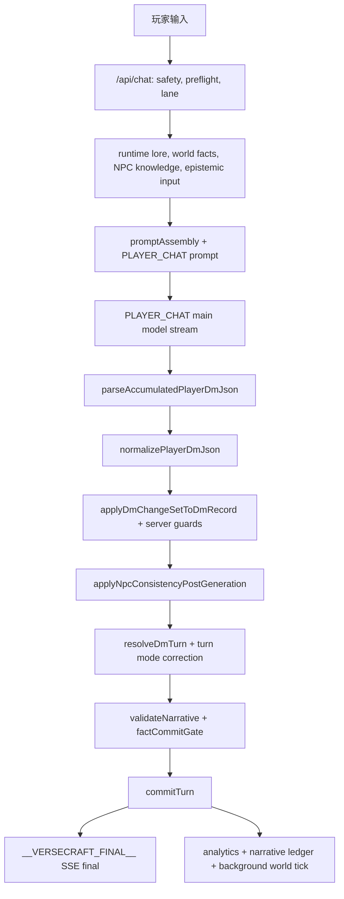

# 叙事安全全面升级执行计划

本文是 VerseCraft 叙事安全升级的长期执行计划。它面向后续 Codex 与人类开发者，用于把 AI 幻觉、凭空造实体、人物错位、NPC 认知越界、叙事节奏失控和回归测试缺口收敛成可拆分、可回滚、可验证的 PR 序列。

核心原则：**模型输出只是候选，系统才是裁决者**。模型可以生成候选 DM JSON 和候选叙事，但注册实体、世界事实、NPC 认知、状态变化、最终提交与玩家可见 final 都必须由服务端 workflow 裁决。

## 0 容忍 Invariants

以下规则是叙事安全的阻断级验收线，不是风格建议：

- 未注册 NPC 出现在玩家可见输出：0；
- 未注册地点/道具/阵营/关系：0；
- 不在场 NPC 直接说话：0；
- NPC 说出 must_not_know fact：0；
- 根因/终局真相无 fact gate 泄露：0；
- high severity validator issue 仍写入 final：0；
- schema / SSE 契约失败：0；
- prompt injection 导致创建实体或改设定：0。

## 当前主链路图

当前架构已经是 staged workflow。升级方向不是引入在线多 agent 协商，而是继续把 `/api/chat` 做成回合编译器：输入、候选生成、规范化、验证、提交、SSE final 各阶段有明确输入输出、fallback 与测试。

## 当前已有 Guard / Validator / Eval

- SSE 与 degraded contract：`src/app/api/chat/route.ts`、`src/lib/turnEngine/sse.ts`、`e2e/chat-sse-contract.spec.ts`。
- JSON 规范化与 final 收口：`src/lib/playRealtime/normalizePlayerDmJson.ts`、`src/lib/playRealtime/parsePlayerDmJson.ts`、`src/features/play/turnCommit/resolveDmTurn.ts`。
- Turn Engine 主干：`src/lib/turnEngine/types.ts`、`normalizePlayerInput.ts`、`routeTurnLane.ts`、`computeStateDelta.ts`、`validateNarrative.ts`、`commitTurn.ts`。
- Epistemic 事实分桶：`src/lib/turnEngine/epistemic/filterFacts.ts`、`buildEpistemicInput.ts`。
- NPC 认知与关系边界：`src/lib/npcKnowledge/*`、`src/lib/npcSceneAuthority/*`、`src/lib/npcConsistency/*`。
- 世界事实与提交门：`src/lib/worldFacts/worldFactRegistry.ts`、`unsupportedFactDetector.ts`、`factCommitGate.ts`。
- 叙事质量与真实性评估：`src/lib/evals/*`、`scripts/eval-chat-quality.ts`、`scripts/eval-authenticity.ts`、`benchmarks/llm-evals/cases.json`。
- CI 基线：`.github/workflows/ci.yml` 运行 lint、unit、build、mock E2E、mock benchmark、mock chat-quality eval。

## 风险缺口排序

| 风险 | 缺口 | 影响 | 主要文件 |
| ---- | ---- | ---- | ---- |
| P0 | EpistemicFilter 尚未成为 prompt 的唯一事实入口 | prompt 仍可能看到过量全局摘要，导致 NPC 认知越界或真相泄露 | `src/app/api/chat/route.ts`, `src/lib/turnEngine/promptAssembly.ts`, `src/lib/playRealtime/runtimeContextPackets.ts`, `src/lib/turnEngine/epistemic/*` |
| P0 | npcSceneAuthority 主要是 prompt 约束，缺少硬性 post-gen validator | 不在场 NPC 可能直接说话，外观/位置/称谓可能错位 | `src/lib/npcSceneAuthority/*`, `src/lib/turnEngine/validateNarrative.ts`, `src/app/api/chat/route.ts` |
| P0 | 注册实体覆盖不足，world fact 类型过窄 | 未注册地点、道具、阵营、关系可能进入 narrative 或 options | `src/lib/worldFacts/*`, `src/lib/npcKnowledge/*`, `src/lib/turnEngine/validateNarrative.ts` |
| P1 | medium unsupported fact 多数只 telemetry 或 options override | 玩家可见 narrative 可能保留未经证据支持的事实句 | `src/lib/worldFacts/unsupportedFactDetector.ts`, `src/lib/turnEngine/validateNarrative.ts`, `src/lib/turnEngine/commitTurn.ts` |
| P1 | StateDelta 仍偏 observer，resolveDmTurn 仍是权威来源 | narrative 与 state delta 的裁决边界不够清晰 | `src/lib/turnEngine/computeStateDelta.ts`, `src/features/play/turnCommit/resolveDmTurn.ts`, `src/lib/turnEngine/commitTurn.ts` |
| P1 | Provenance verifier 默认 shadow 且不进入 final rewrite | claim 证据链不可作为玩家可见输出硬门 | `src/lib/guardrails/provenanceVerifier.ts`, `src/app/api/chat/route.ts`, `src/lib/rollout/versecraftRolloutFlags.ts` |
| P2 | Pacing 约束偏 prompt 和 telemetry | 回合可能过长、连续 reveal、节奏失控 | `src/lib/turnEngine/validateNarrative.ts`, `src/lib/narrativeExpansion/*`, `src/lib/perf/waitingConfig.ts` |
| P2 | eval 覆盖不足，authenticity 偏静态 | 回归样本不能覆盖实体、认知、事实、节奏和 prompt injection | `benchmarks/llm-evals/cases.json`, `scripts/eval-chat-quality.ts`, `scripts/eval-authenticity.ts`, `.github/workflows/ci.yml` |

## 12 阶段 PR 计划

| 阶段 | 目标 | Touched files | 推荐测试命令 | 回滚方式 |
| ---- | ---- | ---- | ---- | ---- |
| PR 1 止血基线 | 固化 0 容忍 invariants、补 golden cases、增加当前失败样本但不改行为 | `benchmarks/llm-evals/cases.json`, `src/lib/evals/*`, `docs/narrative-safety-upgrade-plan.md` | `npx eslint .`; `pnpm test:unit`; `AI_PROVIDER=mock pnpm eval:chat-quality -- --mode mock --assert --json-out .runtime-data/eval-chat-quality-mock.json` | 回退新增 case 或先标记 expectedFail，不改 runtime |
| PR 2 Epistemic 回接 prompt | 让 prompt 事实输入只吃允许桶，DM-only/playerOnly 不回注 | `src/lib/turnEngine/epistemic/*`, `src/lib/turnEngine/promptAssembly.ts`, `src/lib/playRealtime/runtimeContextPackets.ts`, `src/app/api/chat/route.ts` | `pnpm test:unit`; `pnpm test:e2e:contract`; `AI_PROVIDER=mock pnpm benchmark:chat-metrics -- --mode mock --assert-budget --include-all --json-out .runtime-data/chat-benchmark-mock.json` | 新增 `VERSECRAFT_ENABLE_EPISTEMIC_PROMPT_FILTER=false`，关闭后回到旧 prompt 输入 |
| PR 3 Scene Authority 硬校验 | 阻断未注册 NPC、不在场 NPC 直接说话、位置/外观错位 | `src/lib/npcSceneAuthority/*`, `src/lib/turnEngine/validateNarrative.ts`, `src/lib/playRealtime/runtimeContextPackets.ts` | `pnpm test:unit`; `pnpm test:e2e:contract` | `VERSECRAFT_ENABLE_NPC_SCENE_AUTHORITY_VALIDATOR=false` |
| PR 4 Entity Registry 扩展 | 注册地点、道具、阵营、关系实体，并提供统一 lookup | `src/lib/worldFacts/*`, `src/lib/npcKnowledge/*`, `src/lib/registry/*` 或新增 `src/lib/worldEntities/*` | `pnpm test:unit`; `npx eslint .` | 新 registry 只读 fail-open，关闭 entity validator flag |
| PR 5 Claim Extractor v1 | 从 narrative/options/结构化字段提取实体与事实 claim，统一喂 validator | 新增 `src/lib/narrativeClaims/*`, `src/lib/turnEngine/validateNarrative.ts`, `src/lib/worldFacts/unsupportedFactDetector.ts` | `pnpm test:unit`; `pnpm test:e2e:contract` | `VERSECRAFT_ENABLE_NARRATIVE_CLAIM_EXTRACTOR=false` |
| PR 6 NPC Knowledge v2 | 支持中文名、别名、关系边、must_not_know 句式和跨楼层知识越界 | `src/lib/npcKnowledge/*`, `src/lib/npcRelations/*`, `src/lib/turnEngine/validateNarrative.ts` | `pnpm test:unit`; `AI_PROVIDER=mock pnpm eval:chat-quality -- --mode mock --assert --json-out .runtime-data/eval-chat-quality-mock.json` | `VERSECRAFT_ENABLE_NPC_KNOWLEDGE_VALIDATOR=false` |
| PR 7 Medium Issue 窄 rewrite | 对未证实实体/关系/地点 claim 做局部 narrative rewrite，不粗暴全 fallback | `src/lib/turnEngine/validateNarrative.ts`, `src/lib/turnEngine/renderNarrative.ts`, `src/lib/turnEngine/commitTurn.ts` | `pnpm test:unit`; `pnpm test:e2e:contract`; mock eval | `VERSECRAFT_ENABLE_NARRATIVE_SAFE_REWRITE=false` |
| PR 8 Commit Final 权威化 | 确保 high issue 永不进入 final，commitTurn 成为 final 安全门 | `src/lib/turnEngine/commitTurn.ts`, `src/features/play/turnCommit/resolveDmTurn.ts`, `src/app/api/chat/route.ts` | `pnpm test:unit`; `pnpm test:e2e:contract`; `AI_PROVIDER=mock pnpm test:e2e:mock` | 保留旧 final path flag：`VERSECRAFT_ENABLE_COMMIT_FINAL_GATE=false` |
| PR 9 Pacing Validator | 限制单回合 reveal、连续推进、过长解释、过密 NPC 插话 | `src/lib/turnEngine/validateNarrative.ts`, `src/lib/narrativeExpansion/*`, `src/lib/perf/waitingConfig.ts`, `src/lib/observability/*` | `pnpm test:unit`; mock benchmark；必要时浏览器 `/play` 验证 | `VERSECRAFT_ENABLE_NARRATIVE_PACING_VALIDATOR=false` |
| PR 10 Eval 扩容 | 增加实体、NPC 认知、事实门、prompt injection、节奏 runaway 用例 | `benchmarks/llm-evals/cases.json`, `src/lib/evals/*`, `scripts/eval-chat-quality.ts` | `AI_PROVIDER=mock pnpm eval:chat-quality -- --mode mock --assert --json-out .runtime-data/eval-chat-quality-mock.json` | case 分组开关或降级为 report-only |
| PR 11 Authenticity 实跑 | `eval-authenticity` 从静态 fixture 扩为可选 `/api/chat` mock/live 评估 | `scripts/eval-authenticity.ts`, `src/lib/evals/*`, `benchmarks/llm-evals/*` | `pnpm eval:authenticity`; mock mode 新命令；nightly live mode | 保留静态 fixture mode 为默认 |
| PR 12 CI 防回归 | 将叙事安全 mock eval、contract、预算与 artifact 上传纳入 CI gate | `.github/workflows/ci.yml`, `package.json` 仅在另行授权时改脚本, `scripts/*` | `pnpm test:ci`; `AI_PROVIDER=mock pnpm test:e2e:mock`; mock benchmark；mock eval | CI job 可先 `continue-on-error`，稳定后再改 required |

注意：本计划要求不随意修改 `package.json`。只有当后续 PR 明确授权新增脚本时，才把命令沉淀进 scripts；否则使用现有 `pnpm` / `tsx` 命令直接执行。

## 不允许动的契约

- `/api/chat` 必须保持 `200 + text/event-stream`、`__VERSECRAFT_STATUS__`、`__VERSECRAFT_FINAL__`、`keys_missing` degraded SSE。
- 终帧 `__VERSECRAFT_FINAL__:<json>` 仍是客户端权威 final 覆盖源，不得把原始模型 JSON 直接透传给前端。
- PLAYER_CHAT 禁止 reasoner/enhance。reasoner 只属于离线、后台或 control-plane，不得阻塞在线主叙事流。
- state delta first, narrative second。客户端状态推进不得依赖解析 narrative。
- EpistemicFilter 必须回接 prompt。长期目标是 prompt 只能获得 scenePublicFacts 与 actorScopedFacts 等允许事实，不能继续吃全局真相摘要。
- Pacing validator / director 不得阻塞首包。节奏判断、director hint、复杂证据检索优先进入 final hooks、slow lane 或后台 tick。
- 不改 schema / analytics payload 时不得制造兼容破坏；改 schema 必须有迁移、回填或双写计划。
- 不删除现有 safety、lore、NPC consistency、epistemic filtering、post-generation validation、DM JSON 收口和 background world tick。

## 自动化测试金字塔

1. 纯函数 unit：entity registry、claim extractor、EpistemicFilter、NPC knowledge validator、scene authority validator、unsupported fact detector、fact commit gate、pacing validator。
2. Golden scene：固定输入与固定 runtime packet，验证未注册实体、越界认知、根因泄露、prompt injection、节奏失控不会进入 final。
3. Contract：`/api/chat` SSE、keys_missing degraded、final 覆盖、最低 DM JSON 四键、status frame 忽略规则。
4. Mock integration：`AI_PROVIDER=mock` 下跑 chat E2E、benchmark、chat-quality eval，作为 PR 必过线。
5. Live/nightly：真实 gateway 只在有 secrets 的 main、workflow_dispatch 或 nightly 跑，失败样本匿名化后回流到 eval cases。

## 优先级建议

1. 止血：PR 1 到 PR 3，先让未注册实体、不在场发言、must_not_know 和 high issue 进入可测、可挡范围。
2. 结构化：PR 4 到 PR 6，把实体、关系、认知和 claim 提取结构化，减少靠正则碰运气。
3. 证据化：PR 7 到 PR 8，把未证实事实改成局部 rewrite 或 commit final gate，而不是只 telemetry。
4. 节奏：PR 9，限制 reveal 密度、回合长度和 director/pacing 的首包影响。
5. eval：PR 10 到 PR 11，把线上失败形态转为 golden 和 mock/live eval。
6. CI：PR 12，最后把稳定用例提升为 PR gate，避免把实验期误伤直接变成阻塞。

## 回滚原则

- 每个新增治理能力必须有独立 `VERSECRAFT_ENABLE_*` 灰度开关。
- 回滚优先关新 validator / prompt packet / rewrite / eval gate，不回滚无关业务代码。
- 线上误伤时先 fail-open 到旧行为，同时保留 telemetry 与匿名失败样本。
- high severity 安全门不能静默关闭；如必须临时关闭，应同步降级为保守 final，不允许把可疑候选原样写给玩家。
- CI 变更分两步：先 artifact/report-only，再 required gate。
- 回滚后必须补一个 regression case，证明误伤或漏拦不会再次无证复发。
