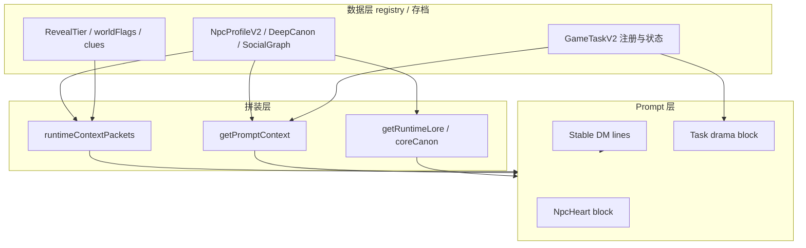

# NPC 人格 · 任务 · 时间 · 校源揭露 — 架构审计与 v2 重构方案

> **阶段**：文档定稿（阶段 1）；**不**含本阶段的代码/UI 改动。  
> **约束对齐**：不破坏现有 UI、主游玩链路、JSON 契约、SSE 形状；小步贴合 `VerseCraft` 现有分层（registry → runtime packets → `getPromptContext` / route → DM）。

---

## 1. 真实根因拆解（基于代码，非臆测）

### 1.1 为什么「NPC 个性会被写平」

| 根因 | 代码位置 | 机制 |
|------|-----------|------|
| **运行时「当下诉求」四档模板化** | `src/lib/npcHeart/selectors.ts`：`whatNpcWantsFromPlayerNow` 仅按 `attitudeLabel`（warm/hostile/guarded/neutral）四选一，与 `npcId` 无关 | 北夏与麟泽在 neutral 时得到同一句「把你的目标说清楚，他会按价码给出交换」，**口语动机与人物差被抹掉**。 |
| **NpcHeart 块极短且结构相同** | `src/lib/npcHeart/prompt.ts`：`buildNpcHeartPromptBlock` 单 NPC 固定行模板 + `maxChars` 默认约 420 总分给最多 5 人 | 可区分的只有 `speechContract` / `taskStyle` 等少量字段；**没有**「本轮唯一禁忌句」「本轮口癖锚点」等防漂移锚。 |
| **`derive*` 启发式趋同** | `src/lib/npcHeart/build.ts`：`deriveTaskStyleFromText`、`deriveTruthfulnessBand`、`deriveManipulationMode` 基于正则与拼接文本 | 社交图字段缺失或文本相似时，多人落到同一 `taskStyle` / `truthfulnessBand`，**数据层差异未放大到 prompt**。 |
| **全局 DM 池 + 关系/任务摘要** | `docs/npc-epistemic-architecture.md` 已述；`useGameStore.getPromptContext` 同时塞任务列表、图鉴、memory spine、`plot_summary` 等 | 模型优先完成「推进任务/解释状态」，**人物腔调让位于任务说明口吻**（客服感、委托感）。 |

### 1.2 为什么「高魅力六人设定很厚，运行时表现很薄」

| 根因 | 代码位置 | 机制 |
|------|-----------|------|
| **厚设定在 deepCanon / 文档，Heart 主吃 V2 浅层 + 社交图** | `npcProfiles.ts` 的 `deepSecret` **未**进入 `buildNpcHeartProfile` 的可执行字段（除 `whatNpcWillNeverAskOpenly` 间接引用 `conspiracyRole`） | 辅锚、残响、并队门槛等 **不会系统性地进入「每回合写作约束」**，除非走 runtime 子包。 |
| **bridge_hints 在 packet，Heart 在 playerContext** | `worldLorePacketBuilders.ts` → `key_npc_lore_packet.major_npc_bridge_hints`；NpcHeart 在 `getPromptContext` 另起一块 | 两路若 budget 紧张被截断，模型可能 **只看到其一**；且 Heart 不携带 `majorNpcBranchSeeds` 的叙事种子。 |
| **分支种子进 canon 但与 Heart 无硬连线** | `majorNpcBranchSeeds.ts` → `buildMajorNpcBranchFactsForCanon` | 种子用于 LoreFact/检索层，**不**自动映射为「当前 NPC 本轮行为脚本」。 |

### 1.3 为什么「高魅力 NPC 容易不稳定（回合间写散、写成同一种人）」

| 根因 | 代码位置 | 机制 |
|------|-----------|------|
| **客户端 NpcHeart 未传入 `maxRevealRank`** | `useGameStore.ts` 调用 `buildNpcHeartRuntimeView` 时 **未传** `maxRevealRank`；`selectors.ts` 默认为 `0` | `mergeNpcBaselineWithRelation`（`npcBaselineAttitude/builders.ts`）中欣蓝 `knows_truth` 视图依赖 `scene.maxRevealRank >= fracture`，**客户端路径永不触发**，与 route 侧 `buildNpcPlayerBaselinePacket`（带真实 rank）**分裂**。 |
| **特权 NPC 共用 `major_charm` 标量桶** | `npcBaselineAttitude/builders.ts`：`scalarsForPrivilege("major_charm")` 六人共用同一组 warmth/guardedness 等 | 数值微调无法区分「交易型 / 诱导型 / 回避型」辅锚，**易向同一「礼貌疏离」收敛**。 |
| **无跨回合「人格状态机」** | 无存档字段表示「本轮句尾习惯是否保持」「是否刚触发 rupture」等 | 仅靠短 prompt，**长对话下漂移不可控**。 |

### 1.4 为什么「校源面会被提前剧透」

| 根因 | 代码位置 | 机制 |
|------|-----------|------|
| **★ `lore` 字段把职能面 + 校源面一并写入可检索正文** | `npcProfiles.ts` `applyNpcProfileOverrides`：`lore: p.interaction.surfaceSecrets.join("；")`（`surfaceSecrets` 第二句多为「校源面：…」）；`registryAdapters.ts`：`detail: npc.lore`、`背景：${npc.lore}` 写入 bootstrap chunks | **检索 / coreCanon 默认「NPC 背景」即含耶里、辅锚、残响等**，与「仅 packet 渐进揭露」目标冲突；违反「不把校源面明牌塞进通用 lore」的产品约束。 |
| **`school_source_packet` 在 fracture 即注入多行「传言+耦合」正文** | `worldSchoolRuntimePackets.ts`：`buildSchoolSourcePacket` 在 `maxRevealRank >= fracture` 时拼接 `rumor_yeliri_echo`、`not_ordinary_wanderer_coupling` 等 | 相对 surface 已是**强方向提示**；deep 再叠 `school_leak_apartment_shell`、`school_wanderer_state`、`seven_anchor_loop`，**全局 JSON 进入单一 DM 上下文**，任意 NPC 台词可被模型借用来「解释世界」。 |
| **欣蓝 stable 与 packet 的「高上限」并存** | `playerChatSystemPrompt.ts`：xinlan-anchor、高魅力例外 | 若 runtime 同时又给足 school/major 子包 + RAG `npc.lore` 全文，**模型有足够材料一口气说尽**。 |

### 1.5 为什么「任务系统让 NPC 更像任务发放器」

| 根因 | 代码位置 | 机制 |
|------|-----------|------|
| **playerContext 任务追踪占显著带宽** | `useGameStore.ts`：`任务追踪：` 多任务 `title|状态|委托|地点` | DM 每回合被提醒「当前可执行目标」，**叙事优先服务清单**。 |
| **`issuerNpcIds` 驱动 NpcHeart 选人** | `selectors.ts` `selectRelevantNpcHearts`：优先 `present` → `issuer` → `volatile` | 有任务时 **发放者与在场者重复进入 Heart**，强化「委托关系」而非「偶遇的人」。 |
| **`buildTaskDramaPacket`** | `src/lib/tasks/drama.ts` | 显式标题「任务戏剧约束」，字段来自 `issuerIntent`/`playerHook` 等；**进一步把回合锚定在任务框内**。 |
| **`taskV2` 能力未强制绑定「非任务互动」** | `taskV2.ts` 丰富字段（dramaticType、residue…）为**可选** | 注册表若未填，则回落为「标题+描述+issuer」的扁平委托。 |

### 1.6 为什么「时间制度压缩角色叙事」

| 根因 | 代码位置 | 机制 |
|------|-----------|------|
| **默认每回合耗 1 游戏小时** | `playerChatSystemPrompt.ts`：`consumes_time` 默认 true，文案说明约 1 游戏小时 | **因果**：玩家心理节奏 =「赶进度」；DM 倾向在单回合内完成「接任务—推进—结算」闭环，**少空间写无效但养人的日常细节**。 |
| **职业系统 hints 显式绑定耗时** | `runtimeContextPackets.ts` `buildProfessionSystemHints`：如巡迹客「控制耗时」 | 强化「时间=资源」隐喻，**挤压慢叙事、沉默、反复试探**。 |
| **`expiresAt` / 任务时钟** | `taskV2.ts` 等 | 逾期失败风险使 **NPC 对话易被写成推进手段**而非关系场景。 |

### 1.7 分层归因：数据层 / Prompt 层 / 运行时拼装层

| 层级 | 主要问题 |
|------|-----------|
| **数据层** | `surfaceSecrets` 与 `lore` 合并导致校源进 RAG；`deepSecret` 未结构化喂给 Heart；六人共用 `major_charm` 标量；任务注册缺戏剧字段时极扁。 |
| **Prompt 层** | Stable 规则正确但依赖模型自律；NpcHeart 模板短、诉求四句化；任务/时间相关指令强化「推进感」。 |
| **运行时拼装层** | `getPromptContext` 的 NpcHeart **缺 `maxRevealRank`**；packet 与 playerContext **双通道**可能不一致；minimal/截断策略可能丢掉 stage2 战术键但仍保留强设定句（见 `runtimeContextPackets` 注释）。 |

---

## 2. 新架构总览（v2 目标形态）

在**不推翻**现有「Stable + 动态后缀 + runtime JSON + playerContext + RAG」的前提下，增加**语义分层**与**门闸对齐**：

1. **人格执行层（Persona Runtime）**：每回合可选的「小状态机 + 差异化约束」，绑定 `npcId`，不增长 JSON 契约（先走字符串块与可选存档影子字段）。
2. **任务语义层（Task Semantics）**：区分「结构任务（UI/存档）」与「叙事压力（prompt 专用）」；委托是后果之一而非唯一口吻。
3. **时间语义层（Time Semantics）**：区分「世界时钟 tick」与「叙事节拍（scene beat）」；允许 `consumes_time=false` 的养人回合有**显式产品规则**而非仅靠模型自觉。
4. **揭露层（Reveal / School Source）**：校源从 **global lore** 剥离为 **tier + hook + anomaly** 三路；通用检索只保留「公寓可观测层」，耶里语义走 packet 与按 fact 标签过滤的检索。

---

## 3. 人物层、任务层、时间层、揭露层的分层关系

**依赖原则**：人物口语与禁忌 **优先** 来自 Persona Runtime + NpcHeart；任务块 **不得**覆盖人物禁区；揭露层 **向下** 只增加「可引用命题」，不反向把校源写进 `npc.lore` 表面字段。

---

## 4. 高魅力 NPC 强化原则

1. **契约不变**：保持现有 `id` / `homeNode` / `questHooks`（`majorNpcQuestHooks.ts` 单一真源）。
2. **差分优先于厚度**：在 prompt 预算内增加 **每人 1–2 条不可协商的口语锚**（来自 `speechPattern` / `majorNpcDeepCanon` 的短摘），避免再堆长设定。
3. **拆桶 `major_charm`**：在 **数据** 上为六人标注 `charmArchetype`（如 `exchange` / `induction` / `buffer` / `mirror` / `border` / `pivot`）→ 映射到不同的 `scalarsForPrivilege` 或独立 `baseline` 微调（小步，不必一次改完六人）。
4. **Heart 与 packet 同源 rank**：任何使用 `mergeNpcBaselineWithRelation` 的路径 **必须** 传入与 `computeMaxRevealRankFromSignals` 一致的 `maxRevealRank`（修复客户端分裂）。
5. **欣蓝**：保留「最强牵引」，但通过 **档位门闸 + 禁止复述 RAG 全长 lore** 限制为「验身、名单焦虑、半步信息」，而非全知总结。

---

## 5. 校源面慢揭露原则

1. **通用 lore 只保留公寓可验证层**：registry 导出给 `NPCS[].lore` 的文本 **不得**含「耶里 / 辅锚 / 七人闭环」等校源命题（迁至 tier 标签事实或 major-only 包）。
2. **packet 已给的仍要「可表演不可讲义」**：`school_source_packet.lines` 宜视为 **氛围与方向**，配合 `antiDumpPolicy`；后续可在不改 schema 前提下改 **切片正文** 为异常/伏笔句式。
3. **检索事实打标签**：bootstrap 中 NPC 相关 fact 分 `surface_apartment` / `school_sourced_fracture_plus` 等，`revealGate` 与 `maxRevealRank` 一致过滤（与现有 `revealTierRank` 对齐）。
4. **branch seeds**：`majorNpcBranchSeeds` 的 canonical 文本 **仅**在达到 `revealMinRank` 时进入检索或缩小摘要，避免低档位抽到「辅锚全貌」。

---

## 6. 任务制度重构原则

1. **issuer 不等于唯一动机**：`buildTaskDramaPacket` 保留，但增加（数据侧）**非 issuer 在场 NPC 的「干扰/旁观」轻提示**可选，打破人人像发任务。
2. **正式目标三类平衡**：继续用 `goalKind` / `inferObjectiveKind`（`taskBoardUi.ts`）；产品上要规定 **character 类任务**占比与「无任务回合」导演策略（`storyDirector` 已有 beat，可挂钩）。
3. **npcProactiveGrant**：冷却与地点已存在；重构方向是 **grant 时写入 spine 一条「关系动机」** 而非仅状态机跳变。
4. **任务文案禁止替代人物**：`issuerIntent` 应可与 `NpcHeart` 的 `coreDrive` 显式校验冲突（未来小函数：标记 tension 供 prompt 使用），制造「嘴上说委托、心里另有恐惧」的可写空间。

---

## 7. 时间制度重构原则

1. **双计时概念**：`gameHour`（世界状态、逾期）vs `narrativeBeat`（本回合是否允许纯对话）；后者 **不**必新增 UI，可用导演状态 + stable 一行规则约束。
2. **consumes_time 策略显式化**：在 route 守卫层记录「连续养人回合数」阈值，防止滥用；**不**改变 JSON 键，只调业务规则与提示。
3. **任务时间与人物时间解耦**：高风险任务维持 `expiresAt` 压力；关系线任务优先 `guidanceLevel: light` + 更长窗口，减少「催命委托」脸谱。

---

## 8. 与现有文件的映射关系

| 主题 | 文件 | v2 中角色 |
|------|------|-----------|
| 六人 V2 展示与 hooks | `src/lib/registry/npcProfiles.ts` | 拆分写入 `lore` 的字段来源；保留 questHooks |
| hooks 真源 | `src/lib/registry/majorNpcQuestHooks.ts` | 不变；与任务注册对齐 |
| 支线种子 | `src/lib/registry/majorNpcBranchSeeds.ts` | 与揭露档位、检索标签联动 |
| 设计书 | `docs/major-npc-school-wanderer-design.md` | 产品正典；实施时对照代码差异 |
| Heart 构建 | `src/lib/npcHeart/build.ts` | 增强差分、减少 derive 撞车 |
| Heart 选择 / 视图 | `src/lib/npcHeart/selectors.ts` | 传入 maxRevealRank；可选扩展 whatNpcWants 按人 |
| Heart prompt | `src/lib/npcHeart/prompt.ts` | 略增锚点字段展示（仍限 chars） |
| 任务模型 | `src/lib/tasks/taskV2.ts` | 数据填充规范，非改结构 |
| 任务板纯函数 | `src/lib/play/taskBoardUi.ts` | 与 goalKind 策略文档对齐 |
| playerContext | `src/store/useGameStore.ts` | 对齐 rank；可选 spine 标签 |
| Stable DM | `src/lib/playRealtime/playerChatSystemPrompt.ts` | 仅必要时加固「lore 非全知」一句 |
| Runtime 包 | `src/lib/playRealtime/runtimeContextPackets.ts` | packet 内容语调与截断顺序调优 |
| 校源 packet | `src/lib/registry/worldSchoolRuntimePackets.ts` | 慢揭露改文案与档位门槛 |
| key_npc / floor | `src/lib/playRealtime/worldLorePacketBuilders.ts` | bridge_hints 与 brief 分离敏感层 |
| 检索 bootstrap | `src/lib/worldKnowledge/bootstrap/registryAdapters.ts` | **lore 切片与 tag** |
| Prompt 集成说明 | `docs/prompt-integration-school-cycle.md` | 实施后同步差异 |
| 认知架构 | `docs/npc-epistemic-architecture.md` | Persona / DM-only 与本文互补 |

---

## 9. 分阶段实施计划

| 阶段 | 内容 | 触碰面 |
|------|------|--------|
| **P0** | 文档与基线：本文件 + 增加 telemetry（prompt 各段字节数） | 观测为主 |
| **P1** | **数据**：`applyNpcProfileOverrides` 将 `lore` 改为仅公寓职能面；校源进单独字段或仅 deepCanon/packet（不进通用 `npc.lore` chunk） | `npcProfiles.ts`、`registryAdapters.ts`、必要时 `npcs.ts` 类型 |
| **P2** | **拼装**：`getPromptContext` 计算或透传 `maxRevealRank`（与 route 同算法解析自 playerContext flags）并传入 `buildNpcHeartRuntimeView` | `useGameStore.ts`、`selectors.ts` |
| **P3** | **人物**：`major_charm` 子类型或六人微调标量；`whatNpcWantsFromPlayerNow` 按 archetype 分支 | `npcBaselineAttitude/builders.ts`、`selectors.ts` |
| **P4** | **揭露**：`school_source_packet` 文案梯度 + RAG fact tag 过滤；branch facts 与档位对齐 | `worldSchoolRuntimePackets.ts`、bootstrap、retrieve gate |
| **P5** | **任务/时间**：导演 beat 与 `consumes_time` 策略、任务注册戏剧字段规范 | `route` 守卫、`storyDirector`、任务 JSON 数据 |
| **P6** | **认知**（可选）：承接 `npc-epistemic-architecture.md` P1–P3 | memory / spine |

---

## 10. 每阶段验收标准

| 阶段 | 验收 |
|------|------|
| P0 | 日志可区分 `memoryBlock` / `playerContext` / `runtimePackets` 长度；无玩法变更 |
| P1 | 抽检：低档位检索结果 **不出现**「辅锚/耶里」类校源长句在通用 NPC `detail`；六人 id/homeNode/hooks 不变 |
| P2 | 同存档 fracture+：客户端 NpcHeart 块中欣蓝 `effectiveView` / baseline 与 runtime `npc_player_baseline_packet` **不矛盾**（人工或单测字符串快照） |
| P3 | 至少 3 位高魅力 NPC 在固定 seed 下 **连续 5 回合**盲测：评审可区分口吻（非双盲也可先内测） |
| P4 | fracture 首见：school_source 仅为异常/传言级；deep 前 **无**七锚闭环完整讲义式输出（规则 + 抽检） |
| P5 | 连续 3 回合无新任务时，叙事仍可出现非委托型互动（导演或 stable 规则 + 抽检） |
| P6 | 文档 C 层指标：串台类报告下降（定性 + 可选关键词审计） |

---

## 11. 风险与回滚策略

| 风险 | 缓解 | 回滚 |
|------|------|------|
| 去掉 `lore` 校源后检索变「干」 | 保留 packet + fracture 后 tagged facts；RAG 补「传言」型短句 | 恢复 `surfaceSecrets` 合并逻辑（不推荐长期） |
| maxRevealRank 客户端解析漂移 | 抽取共用函数 `parseMaxRevealRankFromPlayerContext` 与 route 共用 | 开关关闭传参，回退默认 0 |
| 人物微调过火 | 先上 1–2 人 A/B | `charmArchetype` 映射回滚 |
| TTFT 上升 | 仅加短锚点句，不加长段落；观测 P0 | 调低 `maxChars` 或条数 |

---

## 12. 小结（执行层）

- **最根本修复点**：停止把 **校源面**写进 **通用 `npc.lore` / bootstrap 默认 detail**，否则任何 `revealGate` 都会在「全文已泄漏」前提下失效。  
- **最根本稳定性修复**：**统一 `maxRevealRank`** 到 NpcHeart 与 baseline merge，消灭客户端与 runtime 分裂。  
- **最根本可玩性修复**：**任务与时间提示**从「唯一节奏」改为「人物可偏离的结构」，用导演 beat + 戏剧字段 + consumes_time 策略留餘白。

*文档版本：v1 — 审计锚定仓库路径以 `VerseCraft` 为准；实施时以当时代码行号复核。*
