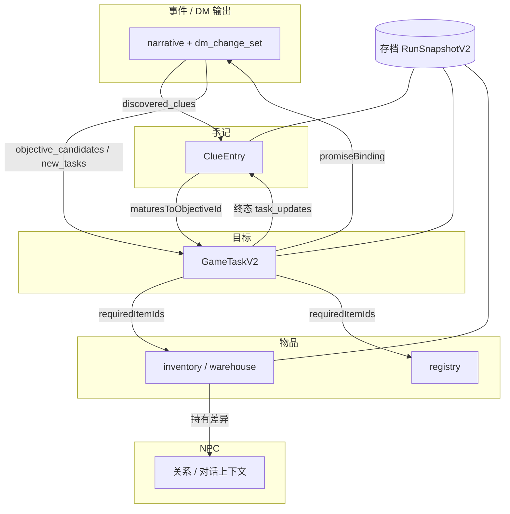

# 阶段 6：系统联动与闭环（叙事咬合）

本文档描述 VerseCraft 中**目标、手记（线索）、物品、NPC、DM 叙事、存档恢复**之间的咬合关系与工程落地。

## 系统联动关系图

## 关键状态一致性规则

1. **事件 → 手记 → 目标**  
   未在叙事中让玩家感知的目标候选可降级为手记；手记可带 `maturesToObjectiveId` 表示升格候选；正式目标宜带 `sourceClueIds`（或变更集 `source_clue_id`）以便追溯。

2. **目标 ↔ 物品**  
   `requiredItemIds` 表示叙事/推进层面的物证门槛：物品须在注册表中存在，或当前已在背包/仓库中（自定义物可被持有即视为合法）。

3. **手记 ↔ 目标**  
   `relatedObjectiveId` 仅指向仍有效的进行中类目标；目标缺失、失败、隐藏时手记上的绑定应解除（由完整性修复执行）。

4. **手记升格指针**  
   `maturesToObjectiveId` 若指向已存在且处于完成/失败/隐藏的目标，升格指针应清除，避免 UI 与提示误导。

5. **承诺目标**  
   `goalKind: promise` 应与 `promiseBinding` 及叙事中玩家明确答应一致；由 stable prompt 约束 DM 行为，服务端仍按既有规则裁剪 `dm_change_set`。

6. **客户端结构化上下文**  
   `clientState.narrativeLinkageDigest` 为短摘要，供路由与审计；**非权威**，权威仍以存档快照与服务端守卫为准。

## 数据修复与兜底策略

实现：`src/lib/domain/narrativeIntegrity.ts` 中 `repairNarrativeCrossRefs`。

| 异常 | 策略 |
|------|------|
| 目标 `requiredItemIds` 引用既不在注册表也不在背包/仓库的 id | 从该目标上修剪；合并 `narrativeTrace.channel=system_repair` |
| 手记 `relatedObjectiveId` 指向不存在任务 | 置 `relatedObjectiveId=null` 并打 repair trace |
| 手记绑定目标状态为 `failed` / `hidden` | 同上 |
| 手记 `maturesToObjectiveId` 指向已存在且为终态（完成/失败/隐藏）的任务 | 移除 `maturesToObjectiveId` 并打 repair trace |

调试开关：`NEXT_PUBLIC_VERSECRAFT_NARRATIVE_DEBUG=1` 或 `VERSECRAFT_NARRATIVE_DEBUG=1`（见 `narrativeDebug.ts`）。读档/云同步后若发生修复且开关开启，会在控制台输出 `repairsApplied` 摘要。

## 存档恢复一致性方案

1. **主路径**  
   `loadGame`、`hydrateFromCloud` 在 `projectSnapshotToLegacy` 之后调用 `applyNarrativeIntegrityOnBundle`，将修复后的 `journal.clues` 与 `tasks` 写回 store 与归一化快照。

2. **崩溃恢复（resume shadow）**  
   当前 shadow 侧重选项、输入模式、日志片段等；**手记若未纳入 shadow，崩溃恢复可能与槽位存档不完全一致**。完整一致应以槽位存档为准，或后续将 `journalClues` 纳入 shadow（可选增强）。

3. **DM stable 提示变更**  
   修改 `playerChatSystemPrompt.ts` 中 stable 规则后，请在部署环境 **bump `VERSECRAFT_DM_STABLE_PROMPT_VERSION`**，避免前缀缓存陈旧。

## 实际代码改造清单（阶段 6）

| 区域 | 文件 | 说明 |
|------|------|------|
| 领域模型 | `narrativeDomain.ts` | `ClueEntry.trace`、`maturesToObjectiveId`；`NarrativeTraceV1` |
| 任务模型 | `taskV2.ts` | `requiredItemIds`、`narrativeTrace`、`sourceClueIds`、`promiseBinding` |
| 手记合并 | `clueMerge.ts` | 草稿字段归一与 trace 合并 |
| 变更集 | `dmChangeSet/schema.ts`、`applyChangeSet.ts` | `matures_to_objective_id`、`source_clue_id`、`required_item_ids` |
| 提示咬合 | `narrativeLinkagePrompt.ts` | `buildNarrativeLinkagePromptBlock` |
| Store | `useGameStore.ts` | `getPromptContext` 注入咬合块；`getStructuredClientStateForServer` 注入 digest；读档完整性 |
| 校验 | `chatValidation.ts` | `ClientStructuredContextV1.narrativeLinkageDigest` |
| 完整性 | `narrativeIntegrity.ts` | 修复与 `checkNarrativeCrossRefs` |
| DM 规则 | `playerChatSystemPrompt.ts` | 阶段 6 stable 规则行 |
| UI | `PlayNarrativeTaskBoard.tsx` | 展示「推进物证门槛」 |
| 测试 | `narrativeIntegrity.test.ts` | 修复行为回归 |
