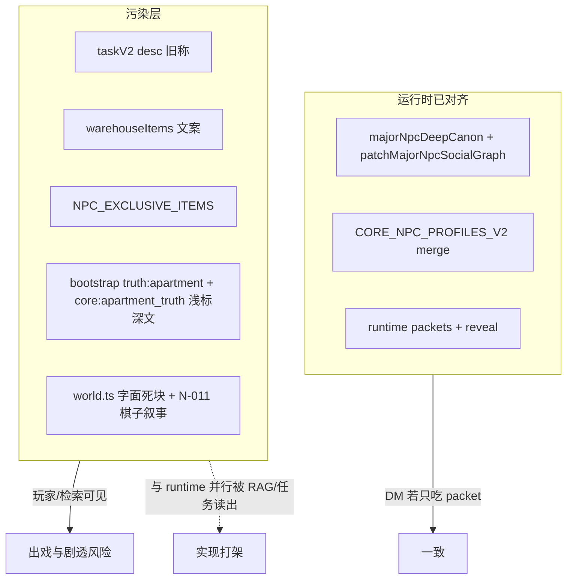

# 世界观冲突审计：旧设定污染与实现层打架（VerseCraft）

**角色**：架构审计 — 仅记录仓库**真实代码**中的冲突点，不实施修复。  
**日期**：2026-03-28（本轮对 `src` 全文关键词与点名文件复核后落盘）。  
**约束对齐**：不臆测未读文件；**不**建议改 UI / NPC id / service id / node id / JSON 契约。

**已逐文件覆盖（用户点名 + 扩展）**：`npcProfiles.ts`、`npcs.ts`、`world.ts`、`rootCanon.ts`、`apartmentTruth.ts`、`registryAdapters.ts`、`coreCanonMapping.ts`、`warehouseItems.ts`、`items.ts`、`taskV2.ts`、`majorNpcDeepCanon.ts`、`majorNpcRelinkRegistry.ts`、`playerChatSystemPrompt.ts`、`revealGate.ts` / `revealTierRank.ts`（标签门闸相关）。

---

## 冲突类型分级

| 级别 | 含义 |
|------|------|
| **致命** | 同一回合内模型可同时读到两套互斥身份/因果，或检索标签与正文严重错位，导致不可控剧透或逻辑崩盘。 |
| **高** | 玩家可见文案（任务/物品/楼层说明）与当前角色表（`npcProfiles` / `majorNpcDeepCanon` / 运行时 packet）明显打架；或权力关系与「欣蓝第一牵引」互斥。 |
| **中** | 源码中残留**未参与运行时合并**的旧叙事块、或仅注释/专名污染；或 bootstrap 标签与内容深度不一致。 |
| **低** | 泛化词（保安室/画家）与场景地理一致、不点名旧职；或已脱离主链路的死代码风险。 |

---

## 一、六位高魅力 NPC：旧身份标签残留矩阵

以下为仓库中出现的**显式旧职名/亡灵叙事**与 **id** 的对应（基于 `rg` 与文件阅读）。

| id | 当前正名（`npcs.ts` / `npcProfiles`） | 仍出现的旧标签/叙事来源 |
|----|----------------------------------------|-------------------------|
| **N-015 麟泽** | 安全边界与锚点见证 | `NPC_EXCLUSIVE_ITEMS`：**电梯维修工**；`world.ts` 字面社交图块（**电梯工、13 楼按钮、物业经理调度**）— *运行时被 `patchMajorNpcSocialGraph` + V2 merge 覆盖，但源码仍存* |
| **N-020 灵伤** | 补给与生活引导 | `NPC_EXCLUSIVE_ITEMS`：**引导员**；`warehouseItems` W-106：**引导员遗落的别针**；`taskV2` `char_newcomer_coverup` desc：**引导员**（issuer 已为灵伤）；`world.ts` 字面块：**诱饵/实习/直属物业经理**— *运行时被覆盖* |
| **N-010 欣蓝** | 路线预告与登记 | `NPC_EXCLUSIVE_ITEMS`：**物业经理**；`warehouseItems` W-103 等「物业」语境；`world.ts` N-011 块：**登记壳层欣蓝是可调度棋子**— *与「第一牵引点/非替身」存在权力叙事张力* |
| **N-018 北夏** | 中立交易与委托 | `NPC_EXCLUSIVE_ITEMS`：**无面保安**；`warehouseItems` 注释 **无面保安**、W-107 **见无面保安五官**；`NIGHT_WATCHMAN_ID = "N-018"`；`taskV2` desc：**无面保安**（issuerName 已为北夏）；`world.ts` 字面块：**维度磨损/镜像脸/倒行者宿敌**— *与「商人壳」可共存为双层，但**玩家向文案仍用旧名*** |
| **N-013 枫** | 7F 线索转运与诱导 | `NPC_EXCLUSIVE_ITEMS`：**钢琴师**；`warehouseItems` W-704：**钢琴师的无声琴键**、**亡灵钢琴**；`world.ts` 字面 N-013 整块：**钢琴亡灵、前世钢琴师、弹完消散**— *运行时被 deep canon 覆盖，源码误导维护者* |
| **N-007 叶** | 隐藏庇护与反向线索 | `NPC_EXCLUSIVE_ITEMS`：**画家**；`warehouseItems` 多条 **画家** 描述；`FLOORS` 5 楼：**独居画家**— *地理与职能可兼容，但专名「画家」与校源美术社叙事需分层* |

---

## 二、文件级冲突清单（含级别与说明）

### 2.1 `src/lib/registry/world.ts`

| 条目 | 级别 | 问题 | 出戏/失控原因 |
|------|------|------|----------------|
| `FLOORS[1]` 描述 | 中 | 「物业经理办公室、新住户引导台」 | 与新六人职能叙事并存时，易让读者/策划默认旧科层制。 |
| `FLOORS[5]` 描述 | 低 | 「503 画室（独居画家）」 | 与叶的新表不矛盾，但「画家」一词可被模型当成唯一身份。 |
| `NPC_EXCLUSIVE_ITEMS`（六人） | **高** | 仍为电梯工/引导员/物业经理/钢琴师/无面保安/画家 | 若未来任何链路重新引用该表进 prompt，会直接叫错职。当前 `rg` 显示**仅在本文件定义**，主 chat 链路未引用 — 风险为**潜伏**。 |
| `NPC_SOCIAL_GRAPH` 字面量（N-013/N-015/N-018/N-020 等） | **中** | 大段旧叙事（钢琴亡灵、电梯封锁 13 楼、无面维度磨损、引导员诱饵） | **模块加载后**被 `patchMajorNpcSocialGraph` + `CORE_NPC_PROFILES_V2` merge **覆盖**；但 Git 阅读、代码评审、误删 patch 时会按旧真相改。 |
| `buildLoreContextForDM` | **中**（潜在致命） | 遍历全图鉴输出超长 fixed_lore | **主 chat 手写 stable 前缀未拼接**（见 `playerChatSystemPrompt.ts`）；但 `scripts/gen-player-chat-stable-prompt.mjs` **仍 import** 该函数，存在「脚本假设 vs 线上行为」漂移。若未来把其接回 stable prompt，会绕过 reveal 与 packet。 |

### 2.2 `src/lib/registry/warehouseItems.ts`

| 条目 | 级别 | 问题 |
|------|------|------|
| 文件头 + `NIGHT_WATCHMAN_ID` | **高** | 注释与常量名将 N-018 固化为「守夜人/无面保安」。 |
| W-106 / W-107 / W-108 / W-501 / W-503 / W-505 / W-704 | **高** | 文案直呼引导员、无面保安五官、钢琴师、亡灵钢琴、画家脸。 |
| `ownerId` | 兼容 | **不得改 id**；应仅改**展示文案**与注释（后续修复阶段）。 |

### 2.3 `src/lib/registry/items.ts`

| 条目 | 级别 | 问题 |
|------|------|------|
| `I-B09`「保安的巡逻表」，`ownerId: "N-018"` | **中** | 名称仍用泛职「保安」，与北夏「商人壳 / 中立交易」表设并存时，玩家与模型易默认**旧无面保安职能**。 |
| 多处「糊弄物业」「物业许愿池」等（如 `I-Dxx`/`I-Cxx` 绑定 `N-010`） | 低–**中** | 「物业」一词与收容场登记壳一致时可接受；若与「欣蓝非科层经理」话术混读，仍可能强化**旧物业经理**联想。 |
| 其余绑定六人之物 | 低 | 如 `I-D44` 指甲剪（N-013）、`I-D14` 钥匙（N-015）等描述未直呼钢琴师/电梯工，**优先风险低于** `warehouseItems` / `taskV2`。 |

### 2.4 `src/lib/tasks/taskV2.ts`

| 条目 | 级别 | 问题 |
|------|------|------|
| `char_mirror_patrol_debt` | **高** | `issuerName: 北夏` 与 `desc` 内「**无面保安**」并存。 |
| `char_newcomer_coverup` | **高** | `issuerName: 灵伤` 与 `desc` 内「**引导员**」并存。 |

### 2.5 `src/lib/registry/npcs.ts`

| 条目 | 级别 | 问题 |
|------|------|------|
| N-005 盲人 `lore` | 低 | 「他曾是钢琴师」— 与 N-013 **旧**钢琴线共鸣；**枫**线仍合理，但勿与「N-013=亡灵钢琴师」旧设定混为一谈。六人本身条目已指向 deep canon。 |

### 2.6 `src/lib/registry/npcProfiles.ts` & `majorNpcDeepCanon.ts`

| 条目 | 级别 | 问题 |
|------|------|------|
| 二者主线 | 低（一致） | 六人 V2 profile 与 deep canon **整体对齐**七锚 / 校源 / 重连方向；**非主要污染源**。 |
| `npcProfiles` 麟泽 `speechPattern` | 低（双层壳） | 「不提校名时**像守夜人**」— 与表层职能徘徊者一致，**非**错误 id；勿与 `warehouseItems` 里「无面保安」旧专名混为一谈。 |
| `majorNpcDeepCanon` 叶之 `reveal` surface 摘要 | 低（双层壳） | 「**冷淡画家**，拒人千里」— 表层地理（503 画室）与美术社校源线一致；若检索只摘 surface 句，可能略强化「画家=唯一身份」，属**交付裁剪**问题而非表内互斥。 |
| `majorNpcDeepCanon` 枫–N-011 关系句 | 低 | 「知老人听**无声演奏**」— 与旧钢琴亡灵字面块语义相邻；**运行时**以本 canon 为准，但文案仍带**旧意象词**，后续若统一话术可改为「无声残响/草案节拍」等（修复阶段、不改 id）。 |

### 2.7 `src/lib/registry/rootCanon.ts` & `apartmentTruth.ts`

| 条目 | 级别 | 问题 |
|------|------|------|
| 关键词扫描 | 低 | 对「钢琴师/无面保安/物业经理/引导员/电梯维修/画家/亡灵」等旧职名 **未见**专名污染（叙事用语走龙胃/七锚/耶里等总纲）。 |
| `IMMUTABLE_ROOT_CANON` | 低–中 | 同时强调 **龙胃泡层** + **耶里缘起** + **七锚** — 与产品方向**一致**，非「旧污染」；若对外话术只讲校源不讲龙胃，会觉跳跃。 |
| `APARTMENT_TRUTH` 拼接 | **中** | 单块文本含完整根因果；**依赖 reveal/RAG 过滤**，不应回灌超长 stable prompt。 |

### 2.8 `src/lib/worldKnowledge/bootstrap/registryAdapters.ts`

| 条目 | 级别 | 问题 |
|------|------|------|
| `truth:apartment` 实体 | **高**（门闸与正文错位时 **致命**） | `detail` 为完整 `APARTMENT_TRUTH`（含七锚、龙胃等），`tags` 含 **`reveal_surface`**（约第 136 行）。 | 若检索仅按 tag 过滤为 surface，仍可能拉出**全文深因果** → **标签与内容深度不一致**。 |
| NPC chunk 循环 | 低 | 使用运行时 `NPC_SOCIAL_GRAPH`（已 patch），六人正文以 deep canon 为准。 |

### 2.8b `src/lib/worldKnowledge/bootstrap/coreCanonMapping.ts`

| 条目 | 级别 | 问题 |
|------|------|------|
| `buildCoreCanonFactsFromRegistry` → `core:apartment_truth` | **高**（同上） | `canonicalText: APARTMENT_TRUTH`，`tags` 含 **`reveal_surface`**（约第 72 行）。 | 与 `registryAdapters` **双路径**把同一全文标成浅层；任何消费 `LoreFact` 且按 tag 门闸的实现都会**复现**同一风险。 |
| `core:apartment_system_canon` | 中 | `reveal_fracture` + 系统因果块 — 与 `truth:apartment_system` 对齐，相对合理；仍需与 `APARTMENT_TRUTH` 整档拆分策略一致。 |

### 2.9 `src/lib/registry/worldOrderRegistry.ts`（经 `apartmentTruth` 间接）

| 条目 | 级别 | 问题 |
|------|------|------|
| 辅锚说明 | 低 | 已写明校源徘徊者与未标定者旧逻辑并存 — **与方向一致**。 |

### 2.10 对齐项（非污染，供对照）

| 文件 | 说明 |
|------|------|
| `src/lib/playRealtime/playerChatSystemPrompt.ts` | 硬规则：欣蓝第一牵引、禁替她剧透七锚全貌 — **与**重构方向一致。 |
| `src/lib/registry/majorNpcRelinkRegistry.ts` | `XINLAN_MAJOR_NPC_ID`、重连条目 — **与**「非传统招募」一致。 |
| `UnifiedMenuModal.tsx` / `locationLabels.ts` | 「一楼保安室」为**节点泛称**（用户约束不改 UI，仅记录）— 非北夏旧专名。 |

### 2.11 `world.ts` 中 **N-011（管理者）** 与欣蓝

| 条目 | 级别 | 问题 |
|------|------|------|
| N-011 `fixed_lore` / `immutable_relationships` | **高** | 「登记壳层（欣蓝）是**可调度棋子**」 | 与 **欣蓝第一牵引点、拒替身、非下属** 的叙事目标冲突；模型若同时吃到 N-011 块与 `major_npc_arc`，可能写成**科层驯化**欣蓝。 |

---

## 三、「表层已改、底层仍旧」类冲突（归纳）

1. **运行时社交图已新、静态表仍旧**：`NPC_EXCLUSIVE_ITEMS`、仓库道具描述、任务 `desc` 仍用旧职名。  
2. **issuerName 已新、任务正文仍旧**：`taskV2` 镜像巡逻、新人圆规则。  
3. **源码字面社交图仍旧、执行路径已 patch**：`world.ts` 内 N-013/N-015/N-018/N-020 大块 — 维护者易误改 patch 后逻辑。  
4. **Bootstrap / CoreFact 标签偏浅、正文极深**：`truth:apartment` 与 `core:apartment_truth` 均承载完整 `APARTMENT_TRUTH` 却标 `reveal_surface` — **双路径同错**。

---

## 四、根叙事「龙胃」vs「校源七锚」

- **非互斥**：`rootCanon` 已把耶里缘起、龙胃泡层、七锚收容写在**同一根目录**；问题在**交付层**（reveal / packet）是否分段，而非根条目自相矛盾。  
- **真正冲突点**：若 RAG 在 surface 档返回完整 `APARTMENT_TRUTH`，则玩家体验上会变成「开局百科全书」— 属 **实现层门闸** 问题，见 2.8。

---

## 五、玩法层「功能 NPC」vs 设定层「七锚核心」

- **系统已部分缓解**：`major_npc_relink_packet`、`reveal_tier`、`school_cycle_arc` 等把「非 instant party」写进 packet；`playerChatSystemPrompt` stable 有硬边界。  
- **仍存缝隙**：任务描述、仓库文案仍像**工具人**（保安记录、引导员漏规则）；与「辅锚/重连」质感不一致 → **高**。

---

## 六、建议修复顺序（实施清单，按优先级）

1. **P0 — 玩家可见文案与 issuer 一致**  
   - `taskV2.ts`：改写 `char_mirror_patrol_debt`、`char_newcomer_coverup` 的 `desc`（保留机制：镜面/倒行者、补规则），去掉「无面保安」「引导员」旧称，与北夏/灵伤人设对齐。  
2. **P0 — 检索标签与正文一致（须双改）**  
   - `registryAdapters.ts`：`truth:apartment` 的 `tags` 与正文深度对齐，或拆实体。  
   - `coreCanonMapping.ts`：`core:apartment_truth` 的 `tags` **同步**同一策略，避免 bootstrap 与 core facts 两套种子行为不一致。  
3. **P1 — 仓库与世界观专名**  
   - `warehouseItems.ts`（及必要时的 `items.ts`）：**不改 ownerId/item id**，仅改 `name/description` 注释，使「商人/补给员/登记口」等与表一致；`NIGHT_WATCHMAN_ID` 可**保留 id**但重命名常量或加弃用注释。  
4. **P1 — `NPC_EXCLUSIVE_ITEMS` 文案**  
   - 六行描述改为**职能壳表述**（仍绑定同一 id），避免电梯工/钢琴师等旧职名。  
5. **P2 — `world.ts` 楼层与 N-011/欣蓝关系**  
   - 弱化「物业经理办公室」等科层联想；修订 N-011 对欣蓝表述为「登记节点/牵引位」而非「棋子」（**不改 id**）。  
6. **P2 — 源码中死块治理**  
   - 将六人旧 `NPC_SOCIAL_GRAPH` 字面块改为 `// LEGACY_REPLACED_BY_PATCH` 占位或删至最小，避免误读（**不改变 patch 运行时行为**）。  
7. **P3 — `buildLoreContextForDM`**  
   - 文档化「禁止接入主 chat」或改为按 reveal 裁剪；防止未来误用。

---

## 七、删除 vs 保留为兼容壳

| 操作 | 建议 |
|------|------|
| **应删除或清空** | 无（id 级数据均保留）。**可删**的是误导性注释、任务 desc 中的错误专名、bootstrap 错误 tag。 |
| **保留为兼容壳** | 北夏与**镜面/倒行者**任务线、灵伤与**新人规则**任务线 — 机制可留，**仅换叙事包装**。龙胃根条目保留，与校源并列。 |
| **绝不能改** | 六位 **NPC id**、**物品/仓库 id**、**服务 id**、**地图 node id**、**JSON 输出契约**、**MAJOR_NPC_IDS 集合**（与 `schoolCycleIds` 一致）。 |

---

## 八、建议新增字段（不破坏旧消费端）

- 可选：`npcProfiles` 或 registry 增加 **`legacySurfaceAlias?: string[]`** 仅供内部审计/迁移注释，**不进入**玩家 JSON。  
- 可选：`truth:apartment` 拆为 `truth:apartment_surface` / `truth:apartment_deep` 两实体，**code 新建**，旧 code 保留别名映射（若 DB 已种需 migration 策略 — 本轮仅建议）。

---

## 九、冲突地图（心智模型）

---

## 十、本轮刻意不做的（避免过度重构）

- 不改 **服务执行**主流程、不改 **play 页 UI**。  
- 不重写 **全部 20 人**社交图，仅聚焦六人相关污染与全局检索标签。  
- 不把世界观 **回灌** stable prompt。  
- 不基于假设新增 **剧情任务链**（仅列文案与标签修复）。

---

**文档维护**：修复落地后，应在本文件对应条目标注 `RESOLVED + PR/提交号`，并复跑 `worldSchoolCycleAcceptance.test.ts` 与任务文案抽检。
