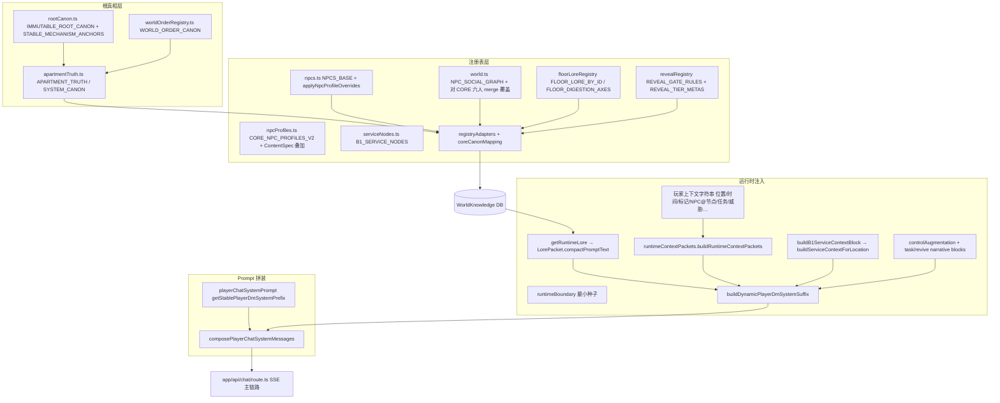

# VerseCraft 世界观 / 高魅力 NPC / 运行时注入链路 — 盘点与改造计划

> 角色：系统架构与「世界观可落地重构」负责人。  
> 前提：**不破坏**现有 UI、主玩法、服务节点、JSON 输出契约、聊天主链路、B1 安全、锻造/任务/图鉴/复活/主威胁系统。  
> 本文档基于仓库 **2026-03-28** 前后代码结构实读整理。

---

## 1. 现状扫描

### 1.1 世界观「真相来源链」（Root → Chat）

数据流是 **多源并列**，不是单线；优先级在稳定 prompt 与代码注释中已写明：**运行时 packet / RAG / 控制层 > 静态记忆**。

**链路边注（与代码对齐）：**

| 阶段 | 关键产物 | 主要文件 |
|------|-----------|----------|
| 根目录 | 龙胃/回声体/B2 出口等短真相 + 机制锚点列表 | `rootCanon.ts` → `apartmentTruth.ts` |
| 秩序叙事块 | B1、锚点复活、原石、管理者、游荡商人 | `worldOrderRegistry.ts` → `apartmentTruth.ts`（`APARTMENT_SYSTEM_CANON`） |
| 结构化注册表 | 楼层消化轴、揭露门闸、NPC 表、社交图、B1 服务 | `floorLoreRegistry.ts`, `revealRegistry.ts`, `npcs.ts`, `npcProfiles.ts`, `world.ts`, `serviceNodes.ts` |
| RAG / Fallback | 实体 chunk、边、truth 条目 | `registryAdapters.ts`, `coreCanonMapping.ts`, `fallbackFromRegistry.ts` |
| 每回合 packet | 单条 JSON 字符串注入（含 reveal/floor/threat/B1/锚点/NPC brief 等） | `runtimeContextPackets.ts` + `worldLorePacketBuilders.ts` + `stage2Packets.ts` |
| 稳定前缀 | 规则、JSON 契约、B1 护栏说明（**当前未内嵌全量 NPC 档案**） | `playerChatSystemPrompt.ts` |
| 整合 | `route.ts` 内拼 `dynamicSuffixFull`、守卫链、`normalizePlayerDmJson` | `app/api/chat/route.ts` |

**与文档/脚本漂移：** `scripts/gen-player-chat-stable-prompt.mjs` 仍假设从 `route.ts` 的 `buildSystemPrompt` 抽取并注入 `buildLoreContextForDM` / `NPCS` 名单；**当前** `playerChatSystemPrompt.ts` 为手写维护的稳定规则，**未**在稳定前缀中拼接 `buildLoreContextForDM()`。世界观长文本主路径在 **RAG + `runtimeLoreCompact` + runtime JSON packet**。

### 1.2 「高魅力 NPC」六人 — 代码落点与绑定

**定义：** `CORE_NPC_PROFILES_V2`（`npcProfiles.ts`）中的 6 条为「深度人设层」；与 `NPCS_BASE` 同 ID **合并**：`applyNpcProfileOverrides` 覆盖 `name/floor/personality/specialty/combatPower/appearance/taboo/lore/location`（`location` ← `homeNode`）。

| id | 对外名（V2 display.name） | homeNode（节点 ID） | publicPersonality（公众面具） | specialty（对外职能标签） | questHooks（剧情钩） | 备注 |
|----|---------------------------|---------------------|-------------------------------|---------------------------|----------------------|------|
| N-015 | 麟泽 | B1_SafeZone | 忧郁、寡言、善良 | 安全边界与锚点见证 | anchor.oath.b1, border.watch.log | 深层：`deepSecret` 含 trueCombatPower、conspiracyRole、revealConditions |
| N-020 | 灵伤 | B1_Storage | 天真、浪漫、纯真 | 补给售卖与生活性引导 | b1.supply.route, memory.ribbon | 同上 |
| N-010 | 欣蓝 | 1F_PropertyOffice | 温柔、克制、御姐 | 路线预告与未来转职登记 | route.preview.1f, career.pre_register | 同上 |
| N-018 | 北夏 | 1F_GuardRoom | 开朗、潇洒、中立 | 中立交易与高价值委托 | merchant.fragment.trade, dragon.space.shard | `combatPowerDisplay: "?"`，dragonWorldLink |
| N-013 | 枫 | 7F_Room701 | 讨喜、机灵、依附感强 | 7F 线索转运与诱导 | boy.cleanse.path, boy.false_rescue | betrayal_flag:boy 等 reveal |
| N-007 | 叶 | 5F_Studio503 | 冷淡、自私、警惕 | 隐藏庇护与反向线索 | sister.mirror.trace, sibling.old_day | 同上 |

**覆盖链路：**

1. **列表/UI 消费：** `NPCS` 导出对象含上述覆盖字段；图鉴/任务若按 `id` 取 `NPC` 接口字段则读到 V2 后的名字与外观等。
2. **运行时 packet：** `buildKeyNpcLorePacket`（`worldLorePacketBuilders.ts`）用 `NPCS.find` 生成 `nearbyNpcBriefs` 的 `id/name/appearance`（appearance 截断 120 字）。
3. **社交/档案：** `world.ts` 在模块加载时对 **仅这六个 id** 执行 merge：用 V2 的 `homeNode`、`surfaceSecrets` 拼成 `fixed_lore`、`trueMotives` 拼成 `core_desires`，并把 `emotional_traits` 设为 `publicPersonality`、`speech_patterns` 设为 `speechPattern`——**与 `NPC_SOCIAL_GRAPH` 原长篇 fixed_lore 被替换**，存在叙事体量收缩与「档案语义迁移」风险（见第 2 节）。
4. **NpcHeart（关系/任务口吻）：** `npcHeart/selectors.ts` 仅对 **存在于 `CORE_NPC_PROFILES_V2` 的 id** 构建 `NpcHeartRuntimeView`；其余 NPC `pickProfile` 为 null 时走降级逻辑。
5. **运行时边界种子：** `runtimeBoundary.ts` 的 `NPC_HOME_LOCATION_SEED` 来自 **merge 后** `NPC_SOCIAL_GRAPH.homeLocation`；`NPC_RELATIONSHIP_HOOK_SEED` 仅来自 **六人** `relationshipHooks`。
6. **ContentSpec：** `CONTENT_SPEC_NPC_PROFILES_V2` 可对同 id 再叠加（`buildNpcProfileV2FromSpec`），需与六人不冲突。

**与 B1 服务表不一致（现状事实，非本次杜撰）：** `serviceNodes.ts` 中商店/锚点/锻造等 `npcIds` 仍大量绑定 **N-008（电工）、N-014（洗衣房阿姨）** 等，与六人中「灵伤 N-020 驻 B1_Storage、麟泽 N-015 驻 B1_SafeZone」的 **叙事 home** 并存——玩法上由 `npcIds` 驱动「谁在场可触发服务叙事」，**不要在未设计迁移前改 service id/npcIds**，否则易破坏 B1 闭环测试与文案预期。

### 1.3 冻结项清单（不可破坏契约）

- **NPC id：** `N-001`–`N-020` 固定；`rootCanon.ts` 中 `STABLE_MECHANISM_ANCHORS` 明确禁止无来源新增角色。
- **服务节点 id：** `ServiceNodeId` 枚举 `B1_SafeZone | B1_Storage | B1_Laundry | B1_PowerRoom` 及 `buildServiceContextForLocation` 输出结构。
- **服务定义 id：** `svc_b1_*` 系列字符串（解锁 flag、前端/测试可能依赖前缀）。
- **`NPC` 接口字段：** `types.ts` 中现有字段名与语义保留；新叙事能力用 **可选扩展** 或 **并行 registry**，不删 `defaultFavorability` 等。
- **DM JSON 契约：** `normalizePlayerDmJson` 白名单、必填键、`applyB1SafetyGuard` 等在 B1 对 `sanity_damage` 的兜底行为保持不变。
- **稳定前缀策略：** 不把大段世界观/NPC 全书塞回 `buildStablePlayerDmSystemLines()`（避免 KV cache 抖动与 TTFT 恶化）；增量走 packet / RAG / 受控小块。
- **主威胁 / 复活 / 锻造 / 任务守卫：** `route.ts` 中 `applyMainThreatUpdateGuard`、`applyB1ServiceExecutionGuard`、`applyStage2SettlementGuard`、`taskV2` 等调用顺序与语义不擅自删减。

---

## 2. 风险点

1. **双轨真相：** 同一 NPC 在 `NPCS.lore`（override 后偏短）与历史 `NPC_SOCIAL_GRAPH` 长文之间，六人已被 merge **覆盖** fixed_lore；RAG chunk 同时含 `npc` 条目与 `social` 段，若未来改 merge 规则需同步 **bootstrap 重刷** 与检索标签。
2. **任务/图鉴字符串：** `questHooks` 为内部钩；若任务表或 seed 仍引用旧任务 id，仅改 profile 会导致 **钩空**——改前需全仓 `grep`。
3. **NpcHeart 覆盖缺口：** 仅六人有完整 V2 heart；大规模「魅力重构」若扩到更多 id，需同步扩展 `CORE_NPC_PROFILES_V2` 或明确降级策略，避免 DM 与 heart 口径分裂。
4. **key_npc_lore_packet 体量：** `nearbyNpcBriefs` 依赖 `NPCS.appearance`；极长 appearance 已被截断，但 name/id 必须与 codex 一致，否则违反稳定 prompt「name 与 id 必须来自运行时事实」。
5. **worldOrderRegistry 与角色别名：** `buildKeyNpcLorePacket` 用 `relationshipHints.includes("夜读")` 触发 elder hint，**硬编码中文片段**；世界观改名时需同步此处与 `playerWorldSignals` 解析。
6. **脚本漂移：** `gen-player-chat-stable-prompt.mjs` 与现 `route`/`playerChatSystemPrompt` 不一致，若重新运行可能 **覆盖** 当前稳定规则；改造时应先对齐生成策略或弃用该脚本。

---

## 3. 文件级改造清单（建议）

| 文件 | 当前职责 | 建议改造方向（兼容扩展优先） |
|------|-----------|------------------------------|
| `rootCanon.ts` | 最短根真相 + 机制锚 | 仅增 **新根条目 id**；不改现有 entry `id` 字符串；锚点列表 **追加** 行而非改写过时句 |
| `apartmentTruth.ts` | 拼接根真相与系统因果 | 保持导出函数签名；新块通过 **子 registry 函数** 拼入，避免单文件爆炸 |
| `worldOrderRegistry.ts` | 秩序/经济/锚点/管理者/商人 | **新增** `WorldOrderCanonEntry` 描述「学制/循环」等；`WORLD_ORDER_CANON` **push** 新 id |
| `npcProfiles.ts` | 六人 V2 + ContentSpec 叠加 | 增字段用 `NpcProfileV2` **可选扩展**；或新增 `schoolCycleMeta` 并行对象按 id 索引 |
| `npcs.ts` | 全量 NPC 基表 + override | **保留** `NPCS_BASE` 历史文本为注释或 `legacyLore` 字段（若类型扩展）；避免删行 |
| `types.ts` | NPC / Service / Item 等类型 | 新增 `optional` 字段；服务与 `ServiceNodeId` **不删枚举值** |
| `world.ts` | FLOORS、MAP、社交图、merge、`buildLoreContextForDM` | merge 逻辑改为 **可配置层**（surface vs deep）或 deep 走独立 registry，避免再次用短句覆盖长 fixed_lore |
| `serviceNodes.ts` | B1 服务绑定 | **不改** `svc_*` id；若叙事上要「灵伤卖货」，优先 **追加 npcIds** 而非替换（需产品确认多 NPC 同台文案） |
| `floorLoreRegistry.ts` | 楼层消化轴 | **追加** 与「学制循环」对齐的 `publicOmen`/`hiddenCausal` 句子时保持原字段名 |
| `revealRegistry.ts` | 揭露门闸 | **追加** `RevealGateRule`；不提高默认 `bumpTo` 以免全局剧透升级 |
| `playerWorldSignals.ts` | 从 playerContext 抽信号 | 若新世界观依赖新标记，**扩展解析** 并文档化标记名 |
| `runtimeContextPackets.ts` | 汇总 JSON packet | **新增** 子 packet 键（如 `worldview_arc_packet`）默认空对象；minimal 模式同样遵守「键可省略或空」的兼容策略 |
| `worldLorePacketBuilders.ts` | 各 lore 子包 | 新叙事从 **新 builder** 导出，由 `buildRuntimeContextPackets` 选择性合并 |
| `stage2Packets.ts` | forge/threat/worldview 等 | `buildWorldviewPacket` **扩展字段** 而非改语义 |
| `playerChatSystemPrompt.ts` | 稳定规则 | 只加 **短约束句**（如「学制循环仅能在 packet 明示时出现」），不加长 lore |
| `registryAdapters.ts` / `coreCanonMapping.ts` | bootstrap 种子 | 新真相注册为 **新 entity code** 或新 tags，便于 RAG 分层 |
| `route.ts` | 编排 | 仅增加对新 packet 的传递或开关；**不**删减守卫 |
| `npcHeart/*` | 深人设运行时视图 | 读取扩展后的 profile；六人外若加 profile，同步 `selectors` |
| `contentSpec/packs/*` | Pack 叠加 | 新剧情优先走 **新 pack 文件**，避免改 base 表 id |

---

## 4. 数据兼容策略

1. **ID 稳定：** 一切新设定挂 **现有 N-*** / 节点 / `svc_*`；新增概念用 **新字符串 id**（任务、world flag、packet 键）。
2. **类型扩展：** `NpcProfileV2`、`LoreFact`、`RuntimeContextPackets` 输出 JSON 使用 **可选键**；前端与 `normalizePlayerDmJson` 未识别的键应 **忽略**（JSON 通用特性）。
3. **叙事分层：**  
   - **表层：** `NPC` 展示字段 + `key_npc_lore_packet` + `PLAYER_SURFACE_LORE`  
   - **裂缝层：** `WORLD_ORDER_CANON` + `floor_lore` + `reveal_tier ≥ 1`  
   - **深层：** `deepSecret` / 独立 `npcTruthRegistry`（建议新建）+ `reveal_tier ≥ 2`  
4. **社交图与 V2：** 停止用 `surfaceSecrets` **完全替换** `fixed_lore`；改为 `fixed_lore` 保留长篇，`maskSummary` 或 `publicMask` 字段走表层（需一次迁移脚本式替换 merge 逻辑）。
5. **RAG：** bootstrap 版本号或 `sourceRef` 递增，便于运维 **重跑 ingestion**。

---

## 5. 实施顺序（建议）

1. **契约与快照：** 导出当前 `NPCS`、`NPC_SOCIAL_GRAPH`（六人段）、`buildRuntimeContextPackets` 样例 JSON，作为回归基线（测试或 `benchmarks/`）。
2. **类型与空 packet：** `types.ts` + `runtimeContextPackets` 增加可选 `worldview_arc_packet`（或等价名），默认 `{}`，确保现有测试绿。
3. **根秩序与新 registry：** `worldOrderRegistry` / 可选新文件 `schoolCycleCanon.ts`（示例名）承载「学制循环」叙事，**不接** 进稳定前缀，只接 packet + RAG。
4. **NPC 分层：** 调整 `world.ts` merge 策略；同步 `coreCanonMapping` chunk 文本。
5. **builders：** `worldLorePacketBuilders` 从新 registry 取摘要注入 packet；揭露仍服从 `maxRevealRank`。
6. **NpcHeart / task 钩：** 对齐 `questHooks` 与任务定义文件（若有）；扩展 heart 到目标 NPC。
7. **文档与脚本：** 更新或废弃 `gen-player-chat-stable-prompt.mjs`，避免误生成覆盖。

---

## 6. 验收口径

- **功能：** B1 内仍无法通过 DM 输出对玩家造成 `sanity_damage>0` 的合法路径（守卫后仍为 0）；锻造/任务/主威胁字段仍能被 `normalizePlayerDmJson` 接受。
- **契约：** 现有客户端解析的 DM JSON 字段 **行为不变**；仅允许 **新增** 可选字段。
- **ID：** 全仓无新增 `N-021+`、无改 `ServiceNodeId`、无改 `svc_b1_*` id。
- **Prompt 体积：** 稳定前缀字符数不明显上升（建议监控 `stableCharLen` 与 KV 命中率）；世界观增量主要体现在 **runtime packet + lore 检索**。
- **一致性：** 六人 `id/name` 在 `NPCS`、`key_npc_lore_packet`、`codex_updates` 规则中一致；`grep questHooks` 均有任务或叙事消费或明确为预留。
- **知识库：** 重跑 bootstrap 后，`truth:apartment` 与新实体可检索，且 `revealGate` 不会在 surface 层泄露深层句。

---

## 7. 附录：相关文件速查（同目录扩展阅读）

- Reveal / floor：`revealRegistry.ts`, `revealTierRank.ts`, `floorLoreRegistry.ts`, `playerSurfaceLore.ts`, `playerWorldSignals.ts`
- Packet 实现：`worldLorePacketBuilders.ts`, `stage2Packets.ts`, `augmentation.ts`
- 任务/复活：`src/lib/tasks/taskV2.ts`, `src/lib/revive/conspiracy.ts`
- 安全：`b1Safety.ts`, `serviceExecution.ts`, `normalizePlayerDmJson.ts`
- Content pack：`src/lib/contentSpec/packs/*.ts`, `builders.ts`

---

*文档版本：v0.1（盘点 + 计划）；实现阶段请在本文件追加「变更记录」小节。*
